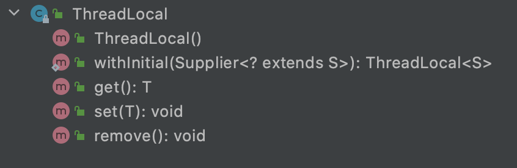
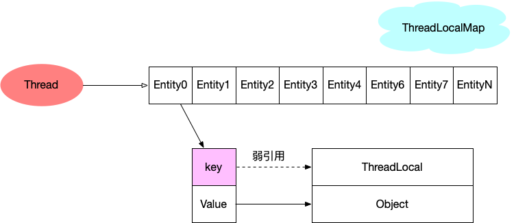
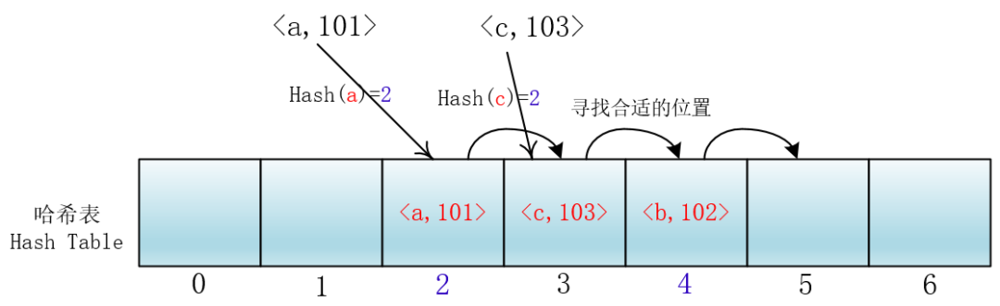

# ThreadLocal

#### 什么是ThreadLocal

TheadLocal可以称为线程本地变量，是一个线程内部的存储类，可以在指定的线程内存储数据，数据存储之后，只有指定的线程才能得到存储的数据。

ThreadLocal是除了加锁这种同步方式之外的一种保证线程安全的手段，通过为每个线程提供一个独立的变量副本解决了变量并发访问的


#### ThreadLocal两大常用场景

##### 场景一：代替参数的显式传递

当我们在写API接口的时候，通常Controller层会接受来自前端的入参，当这个接口功能比较复杂的时候，可能我们调用的Service层内部还调用了 很多其他的很多方法，通常情况下，我们会在每个调用的方法上加上需要传递的参数。

但是如果我们将参数存入ThreadLocal中，那么就不用显式的传递参数了，而是只需要ThreadLocal中获取即可。

##### 场景二：代替参数的显式传递


#### ThreadLocal基本用法

核心API还是比较少的



下面展示API的例子

```java
public class ThreadLocalTest {
    private static ThreadLocal<String> THREAD_LOCAL = ThreadLocal.withInitial(() -> "ThreadLocal...test");

    public static void main(String[] args) {
        System.out.println(THREAD_LOCAL.get());
        THREAD_LOCAL.set("update value");
        System.out.println(THREAD_LOCAL.get());
        THREAD_LOCAL.remove();
    }
}
```

输出结果值如下:

> ThreadLocal...test
> update value

ThreadLocal使用起来很简单，本例子涵盖了ThreadLocal核心api，接下来的内容也是围绕核心api展开学习。


#### ThreadLocalMap

先来看下ThreadLocalMap，**ThreadLocalMap作为Thread的成员变量**。下面我们首先介绍一下ThreadLocalMap

```java
static class ThreadLocalMap {

    /**
     * The entries in this hash map extend WeakReference, using
     * its main ref field as the key (which is always a
     * ThreadLocal object).  Note that null keys (i.e. entry.get()
     * == null) mean that the key is no longer referenced, so the
     * entry can be expunged from table.  Such entries are referred to	
     * as "stale entries" in the code that follows.
     */
    static class Entry extends WeakReference<ThreadLocal<?>> {
        /** The value associated with this ThreadLocal. */
        Object value;

        Entry(ThreadLocal<?> k, Object v) {
            super(k);
            value = v;
        }
    }

    /**
     * The initial capacity -- MUST be a power of two.
     */
    private static final int INITIAL_CAPACITY = 16;

    /**
     * The table, resized as necessary.
     * table.length MUST always be a power of two.
     */
    private Entry[] table;

    /**
     * The number of entries in the table.
     */
    private int size = 0;

    /**
     * The next size value at which to resize.
     */
    private int threshold; // Default to 0
    
    // 省略其他代码
}
```

这里我们可以看到ThreadLocalMap为一个Entity数组，初始化大小为16，Entry因为继承**WeakReference**，key为ThreadLocal对象调用是父类的构造方法，所以key是以弱引用的方式指向对象。因为**ThreadLocalMap做为Thread的成员变量**，所以如果程序中使用到ThreadLocal，那么当前线程就会创建一个ThreadLocalMap，下面我们给出ThreadLocalMap的数据结构图



> 强引用：对象有强引用与之关联，JVM必定不会回收这个对象，即使在内存不足的情况下，JVM宁愿抛出OutOfMemory错误也不会回收这种对象。（只有对象认定为不可达才会被回收）。
>
> 弱引用：如果一个对象只具有弱引用，则不管java虚拟机内存是否足够，在垃圾回收器扫描它所管辖的范围的过程，一旦gc发现对象为weakReference可达，就会把它放到ReferenceQueue，等待下次gc回收它。


在进行源码分析之前， 我们先来看下面这段代码

```java
//在某一线程声明了ABC三种类型的ThreadLocal
ThreadLocal<A> sThreadLocalA = new ThreadLocal<A>();
ThreadLocal<B> sThreadLocalB = new ThreadLocal<B>();
ThreadLocal<C> sThreadLocalC = new ThreadLocal<C>();
```

由前面我们知道对于一个Thread来说只有持有一个ThreadLocalMap，所以ABC对应同一个ThreadLocalMap对象。为了管理ABC，于是将他们存储在一个数组的不同位置，而这个数组就是上面提到的Entry型的数组table变量。ThreadLocalMap为了提高搜索效率，采用hash表方式来实现，解决hash冲突的方式采用**开放地址法**中的**线性探测法**来解决hash冲突，基本思路如下图



由于Hash(a)和Hash(c)值相等，下标2的位置已经存储了a，所以c会继续向后遍历，找到一个非空的位置存储。

#### Set

ThreadLocal#set

```java
public void set(T value) {
    Thread t = Thread.currentThread();
    // 获取当前线程的ThreadLocalMap
    ThreadLocalMap map = getMap(t);
    if (map != null)
        map.set(this, value);
    else
        createMap(t, value);
}
```

优先关注createMap代码逻辑，ThreadLocal#createMap

```java
void createMap(Thread t, T firstValue) {
    t.threadLocals = new ThreadLocalMap(this, firstValue);
}
```

ThreadLocalMap构造方法

```java
ThreadLocalMap(ThreadLocal<?> firstKey, Object firstValue) {
    // 初始化数组大小为16
    table = new Entry[INITIAL_CAPACITY];
    // 根据hash值获取在数组中的位置
    int i = firstKey.threadLocalHashCode & (INITIAL_CAPACITY - 1);
    table[i] = new Entry(firstKey, firstValue);
    size = 1;
    // 设置阀值 16*2/3 = 8
    setThreshold(INITIAL_CAPACITY);
}
```

> 1.firstKey.threadLocalHashCode & (INITIAL_CAPACITY - 1)位运算取模效率更高
>
> 2.计算ThreadLocal所在Entry数组的位置是通过hashCode取模计算而来（和HashMap一样）

firstKey.threadLocalHashCode代码如下

```java
private final int threadLocalHashCode = nextHashCode();

/**
 * The next hash code to be given out. Updated atomically. Starts at
 * zero.
 */
private static AtomicInteger nextHashCode =
    new AtomicInteger();

/**
 * The difference between successively generated hash codes - turns
 * implicit sequential thread-local IDs into near-optimally spread
 * multiplicative hash values for power-of-two-sized tables.
 */
private static final int HASH_INCREMENT = 0x61c88647;


private static int nextHashCode() {
  return nextHashCode.getAndAdd(HASH_INCREMENT);
}
```

因为static的原因，在每次`new ThreadLocal`时因为`threadLocalHashCode`的初始化，会使`nextHashCode`值自增一次，增量为0x61c88647。

0x61c88647是**斐波那契散列**乘数，它的优点是通过它散列(hash)出来的结果分布会比较均匀，可以很大程度上避免hash冲突，已初始容量16为例，hash并与15位运算计算数组下标结果如下：

| **hashCode** | **数组下标** |
| ------------ | ------------ |
| 0x61c88647   | 7            |
| 0xc3910c8e   | 14           |
| 0x255992d5   | 5            |
| 0x8722191c   | 12           |
| 0xe8ea9f63   | 3            |
| 0x4ab325aa   | 10           |
| 0xac7babf1   | 1            |
| 0xe443238    | 8            |
| 0x700cb87f   | 15           |

对于同一线程的不同ThreadLocal来讲，这些ThreadLocal实例共享一个table数组，然后每个ThreadLocal实例在table中的位置i是不同的。

ThreadLocalMap#set

```java
private void set(ThreadLocal<?> key, Object value) {

    // We don't use a fast path as with get() because it is at
    // least as common to use set() to create new entries as
    // it is to replace existing ones, in which case, a fast
    // path would fail more often than not.

    Entry[] tab = table;
    int len = tab.length;
    // hashCode值取模获取
    int i = key.threadLocalHashCode & (len-1);
		// 
    for (Entry e = tab[i];
         e != null;
         e = tab[i = nextIndex(i, len)]) {
        ThreadLocal<?> k = e.get();

        if (k == key) {
            // key就是当前的ThreadLocal对象，进行值更新
            e.value = value;
            return;
        }

        if (k == null) {
            // entity节点对象不为空，但是key为空，说明该key弱指向的ThreadLocal对象已经被回收，
            // 说明该entity节点对象是一个废弃对象，需要被回收
            replaceStaleEntry(key, value, i);
            return;
        }
    }

    tab[i] = new Entry(key, value);
    int sz = ++size;
    if (!cleanSomeSlots(i, sz) && sz >= threshold)
        rehash();
}

/**
 * 到达数组尾部后，会置为0
 */
private static int nextIndex(int i, int len) {
  return ((i + 1 < len) ? i + 1 : 0);
}

```

ThreadLocalMap#replaceStaleEntry

```java
private void replaceStaleEntry(ThreadLocal<?> key, Object value,
                               int staleSlot) {
    Entry[] tab = table;
    int len = tab.length;
    Entry e;

    // Back up to check for prior stale entry in current run.
    // We clean out whole runs at a time to avoid continual
    // incremental rehashing due to garbage collector freeing
    // up refs in bunches (i.e., whenever the collector runs).
    int slotToExpunge = staleSlot;
    // 向前遍历找到key为空
    for (int i = prevIndex(staleSlot, len);
         (e = tab[i]) != null;
         i = prevIndex(i, len))
        if (e.get() == null)
            slotToExpunge = i;

    // Find either the key or trailing null slot of run, whichever
    // occurs first
    for (int i = nextIndex(staleSlot, len);
         (e = tab[i]) != null;
         i = nextIndex(i, len)) {
        ThreadLocal<?> k = e.get();

        // If we find key, then we need to swap it
        // with the stale entry to maintain hash table order.
        // The newly stale slot, or any other stale slot
        // encountered above it, can then be sent to expungeStaleEntry
        // to remove or rehash all of the other entries in run.
        // 向staleSlot后遍历
        if (k == key) {
            // 如果找到以当前ThreadLocal为key的entity节点对象， 和staleSlot位置entity节点交换位置
            e.value = value;

            tab[i] = tab[staleSlot];
            tab[staleSlot] = e;

            // Start expunge at preceding stale entry if it exists
            if (slotToExpunge == staleSlot)
                slotToExpunge = i;
            // 清理
            cleanSomeSlots(expungeStaleEntry(slotToExpunge), len);
            return;
        }

        // If we didn't find stale entry on backward scan, the
        // first stale entry seen while scanning for key is the
        // first still present in the run.
        if (k == null && slotToExpunge == staleSlot)
            slotToExpunge = i;
    }

    // If key not found, put new entry in stale slot
    tab[staleSlot].value = null;
    tab[staleSlot] = new Entry(key, value);

    // If there are any other stale entries in run, expunge them
    // 如果slotToExpunge!=staleSlot，说明存在脏的entity节点数据（key为null的非空entity节点数据）
    if (slotToExpunge != staleSlot)
        cleanSomeSlots(expungeStaleEntry(slotToExpunge), len);
}
```

ThreadLocalMap#expungeStaleEntry

```java
private int expungeStaleEntry(int staleSlot) {
    Entry[] tab = table;
    int len = tab.length;

    // expunge entry at staleSlot
    // 剔除staleSlot的entity节点对象
    tab[staleSlot].value = null;
    tab[staleSlot] = null;
    size--;

    // Rehash until we encounter null
    Entry e;
    int i;
    for (i = nextIndex(staleSlot, len);
         (e = tab[i]) != null;
         i = nextIndex(i, len)) {
        ThreadLocal<?> k = e.get();
        if (k == null) {
          	// 对entity节点对象中key为null的节点进行剔除
            e.value = null;
            tab[i] = null;
            size--;
        } else {
            // 重新计算Hash值
            int h = k.threadLocalHashCode & (len - 1);
            if (h != i) {
                tab[i] = null;
	
                // Unlike Knuth 6.4 Algorithm R, we must scan until
                // null because multiple entries could have been stale.
              	// 如果产生Hash冲突，往下遍历找到下一个空节点
                while (tab[h] != null)
                    h = nextIndex(h, len);
                tab[h] = e;
            }
        }
    }
    return i;
}
```

> 向staleSlot后面的位置开始遍历，如果entity节点对象的key为空，就对Entity对象进行回收，否则对entity节点对象进行调整hash值

ThreadLocalMap#cleanSomeSlots

```java
private boolean cleanSomeSlots(int i, int n) {
    boolean removed = false;
    Entry[] tab = table;
    int len = tab.length;
    do {
        i = nextIndex(i, len);
        Entry e = tab[i];
        if (e != null && e.get() == null) {
            n = len;
            removed = true;
            // 执行删除脏的节点(key为null的节点)
            i = expungeStaleEntry(i);
        }
    } while ( (n >>>= 1) != 0);
    return removed;
}
```

> 进行`log 2 n `次进行向i后面的位置遍历，清理脏的节点数据

ThreadLocalMap#rehash

```java
/**
 * Re-pack and/or re-size the table. First scan the entire
 * table removing stale entries. If this doesn't sufficiently
 * shrink the size of the table, double the table size.
 */
private void rehash() {
    expungeStaleEntries();

    // Use lower threshold for doubling to avoid hysteresis
    // 大小是否超过阀值的3/4
    if (size >= threshold - threshold / 4)
        resize();
}

/**
 * 遍历所有不为空的节点，如果节点key为空就调用expungeStaleEntry()方法进行清理
 */
private void expungeStaleEntries() {
  Entry[] tab = table;
  int len = tab.length;
  for (int j = 0; j < len; j++) {
    Entry e = tab[j];
    if (e != null && e.get() == null)
      expungeStaleEntry(j);
  }
}

/**
 * Double the capacity of the table.
 */
private void resize() {
    Entry[] oldTab = table;
    // 扩容2倍
    int oldLen = oldTab.length;
    int newLen = oldLen * 2;
    Entry[] newTab = new Entry[newLen];
    int count = 0;

    for (int j = 0; j < oldLen; ++j) {
        // 遍历所有节点，如果节点的key为空就进行回收，否则重新计算hash值放置新的位置
        Entry e = oldTab[j];
        if (e != null) {
            ThreadLocal<?> k = e.get();
            if (k == null) {
                e.value = null; // Help the GC
            } else {
              	// 重新计算hash值
                int h = k.threadLocalHashCode & (newLen - 1);
                while (newTab[h] != null)
                    h = nextIndex(h, newLen);
                newTab[h] = e;
                count++;
            }
        }
    }
	  // 重新计算阀值
    setThreshold(newLen);
    size = count;
    table = newTab;
}
```


#### Get

ThreadLocal#get

```java
public T get() {
    Thread t = Thread.currentThread();
    // 获取当前线程的ThreadLocalMap
    ThreadLocalMap map = getMap(t);
    if (map != null) {
        ThreadLocalMap.Entry e = map.getEntry(this);
        if (e != null) {
            @SuppressWarnings("unchecked")
            T result = (T)e.value;
            return result;
        }
    }
    return setInitialValue();
}
```

ThreadLocal#setInitialValue

```java
private T setInitialValue() {
    // 调用初始化接口获取值
    T value = initialValue();
    Thread t = Thread.currentThread();
    ThreadLocalMap map = getMap(t);
    // map不为空就进行set，否则创建新的ThreadLocalMap
    if (map != null)
        map.set(this, value);
    else
        createMap(t, value);
    return value;
}
```


#### Remove

ThreadLocal#remove

```java
private void remove(ThreadLocal<?> key) {
    Entry[] tab = table;
    int len = tab.length;
    int i = key.threadLocalHashCode & (len-1);
    for (Entry e = tab[i];
         e != null;
         e = tab[i = nextIndex(i, len)]) {
        if (e.get() == key) {
          	// 遍历获取key节点
            // this.referent = null;
            e.clear();
            // 清理脏节点数据
            expungeStaleEntry(i);
            return;
        }
    }
}
```

以上基本的核心api已经介绍完毕
