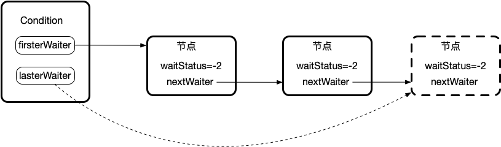
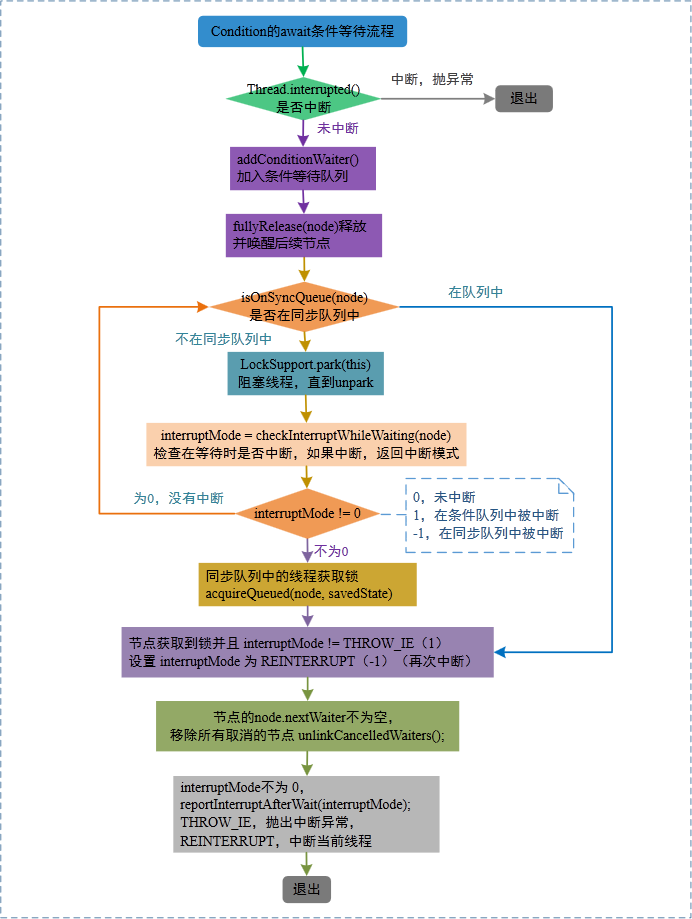
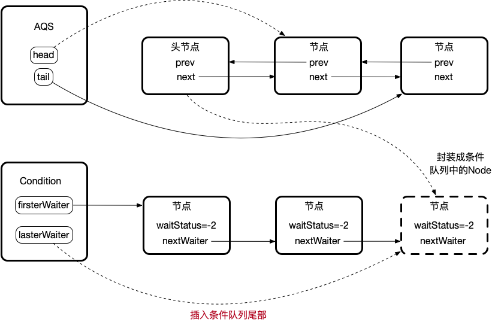
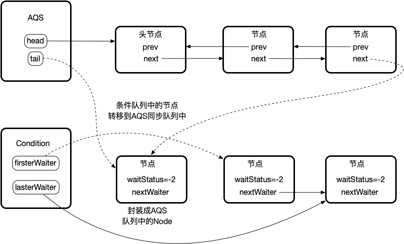

# ConditionObject源码分析

#### **前言**

本篇分析的基础建立在熟悉AQS源码的情况下去进行分析，建议可以先去阅读[ReentrantLock](ReentrantLock.md)去熟悉AQS工作原理。

ConditionObeject实现Condition接口,一般看一个类实现的接口可以看出它的目的,其实也是熟悉API.
Condition的目的主要是替代Object的wait,notify,notifyAll方法的,它是基于Lock实现的。

**Condition**的方法以及描述如下：

| 方法名称                                                     | 描 述                                                        |
| ------------------------------------------------------------ | ------------------------------------------------------------ |
| void await() throws InterruptedException                     | 当前线程进入等待状态直到被通知（signal）或中断。             |
| void awaitUninterruptibly()                                  | 当前线程进入等待状态直到被通知，该方法不响应中断。           |
| long awaitNanos(long nanosTimeout) throws InterruptedException | 当前线程进入等待状态直到被通知、中断或者超时，返回值表示剩余超时时间。 |
| boolean awaitUntil(Date deadline) throws InterruptedException | 当前线程进入等待状态直到被通知、中断或者到某个时间。如果没有到指定时间就被通知，方法返回 true，否则，表示到了指定时间，返回 false。 |
| void signal()                                                | 唤醒一个等待在 Condition 上的线程，该线程从等待方法返回前必须获得与 Condition 相关联的锁。 |
| void signalAll()                                             | 唤醒所有等待在 Condition 上的线程，能够从等待方法返回的线程必须获得与 Condition 相关联的锁。 |

#### Condition使用

Condition也称为条件队列，与内置锁关联的条件队列类似，它是一种广义的内置条件队列。它提供给线程一种方式使得该线程在调用wait方法后执行挂起操作，直到线程的等待的某个条件为真时被唤醒。 条件队列必须跟锁一起使用的，因为对共享状态变量的访问发生在多线程环境下，原理与内部条件队列一样。一个Condition的实例必须跟一个Lock绑定， Condition一般作为Lock的内部类现。

```java
public class BoundedBuffer {
    final Lock lock = new ReentrantLock();
    final Condition notFull = lock.newCondition();
    final Condition notEmpty = lock.newCondition();

    final Object[] items = new Object[100];
    int putIndex, takeIndex, count;

    public void offer(Object x) throws InterruptedException {
        lock.lock();
        try {
            while (count == items.length)
                notFull.await();
            items[putIndex] = x;
            if (++putIndex == items.length)
                putIndex = 0;
            count++;
            notEmpty.signal();
        } finally {
            lock.unlock();
        }
    }

    public Object take() throws InterruptedException {
        lock.lockInterruptibly();
        try {
            while (count == 0)
                notEmpty.await();
            Object x = items[takeIndex];
            items[takeIndex] = null;
            if (++takeIndex == items.length)
                takeIndex = 0;
            count--;
            notFull.signal();
            return x;
        } finally {
            lock.unlock();
        }
    }
}
```

> 这里也就是ArrayBlockingQueue take()和offer()的内部实现（这里简化了一下代码），阻塞队列、线程池源码都有ConditionObeject进行使用，掌握该源码总体思路对于后续理解并发工具还是很具有受益的。

#### 数据结构

下面是**实现ConditionObject的数据结构**: 是一个FIFO的队列，在队列的每个节点都包含了一个线程引用。该线程就是在Condition对象上等待的线程。这里的节点和AQS中的同步队列中的节点一样，使用的都是AbstractQueuedSynchronizer.Node类，只使用了nextWaiter指向下一个节点，和我们之前说的AQS的双向队列（使用prev、next）不同。每个调用了condition.await()的线程都会进入到条件队列中去。



```java
// 只运用这个变量指向下一个节点
Node nextWaiter;
// Node节点的waitStatus = -2这种状态值也会运用
static final int CONDITION = -2;
```

#### 条件队列的等待和唤醒操作

条件队列上的等待和唤醒操作，本质上是节点在AQS队列和条件队列之间相互转移的过程，当需要等待某个条件时，线程会将当前节点添加到条件队列中，并释放锁；当某个线程执行条件队列的唤醒操作，则会将条件队列的节点转移到AQS队列。每个Condition就是一个条件队列，可以通过Lock的newCondition创建多个等待条件。操作流程如下：

AbstractQueuedSynchronizer.ConditionObject#await

```java
public final void await() throws InterruptedException {
    if (Thread.interrupted())
        throw new InterruptedException();
    // 将当前线程添加到条件队列中
    Node node = addConditionWaiter();
    // 当前线程锁释放并唤醒AQS队列后续节点
    // AQS中的fullyRelease方法
    int savedState = fullyRelease(node);
    int interruptMode = 0;
    while (!isOnSyncQueue(node)) {
        // node不在等待队列中，挂起当前线程
        LockSupport.park(this);
        // 检查在等待时是否中断，如果中断，返回中断模式
        if ((interruptMode = checkInterruptWhileWaiting(node)) != 0)
            break;
    }
    // 尝试获锁
    if (acquireQueued(node, savedState) && interruptMode != THROW_IE)
        // 当前线程中断状态 并且 状态模式不是THROW_IE
        interruptMode = REINTERRUPT;
    if (node.nextWaiter != null) // clean up if cancelled
        // 当前节点的下一个等待者，不为空，移除所有取消的节点
        unlinkCancelledWaiters();
    if (interruptMode != 0)
        // 发生中断
        // 处理中断
        reportInterruptAfterWait(interruptMode);
}
```

AbstractQueuedSynchronizer.ConditionObject#addConditionWaiter

```java
private Node addConditionWaiter() {
    Node t = lastWaiter;
    // If lastWaiter is cancelled, clean out.
    if (t != null && t.waitStatus != Node.CONDITION) {
        // 尾节点如果不是CONDITION状态，则表示该节点不处于等待状态，需要清理节点
        unlinkCancelledWaiters();
        t = lastWaiter;
    }
    // 根据当前线程创建Node节点
    Node node = new Node(Thread.currentThread(), Node.CONDITION);
    // 将该节点加入等待队列的末尾
    if (t == null)
        firstWaiter = node;
    else
        t.nextWaiter = node;
    lastWaiter = node;
    return node;
}
```

AbstractQueuedSynchronizer.ConditionObject#unlinkCancelledWaiters

```java
/**
 * 移除队列中waiterStats不为-2的节点，并重新调整firstWaiter和lastWaiter所指向的节点
 */
private void unlinkCancelledWaiters() {
    Node t = firstWaiter;
    Node trail = null;
    while (t != null) {
        Node next = t.nextWaiter;
        if (t.waitStatus != Node.CONDITION) {
            t.nextWaiter = null;
            if (trail == null)
                firstWaiter = next;
            else
                trail.nextWaiter = next;
            if (next == null)
                lastWaiter = trail;
        }
        else
            trail = t;
        t = next;
    }
}
```

AbstractQueuedSynchronizer#isOnSyncQueue是否在同步队列中

```java
final boolean isOnSyncQueue(Node node) {
    if (node.waitStatus == Node.CONDITION || node.prev == null)
        // 节点状态为CONDITION，或者前驱节点为null，返回false
        return false;
    if (node.next != null) // If has successor, it must be on queue
        // 后继节点不为null，那么肯定在同步队列中
        return true;
    /*
     * node.prev can be non-null, but not yet on queue because
     * the CAS to place it on queue can fail. So we have to
     * traverse from tail to make sure it actually made it.  It
     * will always be near the tail in calls to this method, and
     * unless the CAS failed (which is unlikely), it will be
     * there, so we hardly ever traverse much.
     */
    return findNodeFromTail(node);
}
```

AbstractQueuedSynchronizer#findNodeFromTail

```java
/**
 * 遍历等待队列，判断是否为node节点，如果node节点在等待队列中返回true，否则返回false
 */
private boolean findNodeFromTail(Node node) {
    Node t = tail;
    for (;;) {
        if (t == node)
            return true;
        if (t == null)
            return false;
        t = t.prev;
    }
}
```

AbstractQueuedSynchronizer.ConditionObject#reportInterruptAfterWait

```java
private void reportInterruptAfterWait(int interruptMode)
    throws InterruptedException {
    if (interruptMode == THROW_IE)
        // 中断模式为THROW_IE就抛出异常
        throw new InterruptedException();
    else if (interruptMode == REINTERRUPT)
        // 中断模式为REINTERRUPT就进行重新中断
        selfInterrupt();
}
```

**await等待的流程**如下图所示



**await节点中变化图**




条件队列线程唤醒方法AbstractQueuedSynchronizer.ConditionObject#signal

```java
public final void signal() {
    if (!isHeldExclusively())
        throw new IllegalMonitorStateException();
    // 条件队列首节点
    Node first = firstWaiter;
    if (first != null)
        // 不为空
        doSignal(first);
}
```

AbstractQueuedSynchronizer.ConditionObject#doSignal

```java
private void doSignal(Node first) {
    do {
        if ( (firstWaiter = first.nextWaiter) == null)
            lastWaiter = null;
        first.nextWaiter = null;
    } while (!transferForSignal(first) &&
             (first = firstWaiter) != null);
}
```

AbstractQueuedSynchronizer.ConditionObject#doSignal

```java
final boolean transferForSignal(Node node) {
    /*
     * If cannot change waitStatus, the node has been cancelled.
     */
    // 尝试将node节点状态变为0
    if (!compareAndSetWaitStatus(node, Node.CONDITION, 0))
        return false;

    /*
     * Splice onto queue and try to set waitStatus of predecessor to
     * indicate that thread is (probably) waiting. If cancelled or
     * attempt to set waitStatus fails, wake up to resync (in which
     * case the waitStatus can be transiently and harmlessly wrong).
     */
    // 入AQS同步队列等待执行
    Node p = enq(node);
    int ws = p.waitStatus;
    if (ws > 0 || !compareAndSetWaitStatus(p, ws, Node.SIGNAL))
        // 如果状态取消 或者 状态改变失败
        LockSupport.unpark(node.thread);
    return true;
}
```

**signal节点中的状态变化**如下图所示



#### **总结**

当线程lock获取到锁后， 后续使用await方法就会将当前线程锁释放，然后将节点添加条件队列尾部并进行阻塞；当调用signal后 ，会将条件队列的首节点添加到AQS同步队列的尾部，等待被唤醒和获取锁。