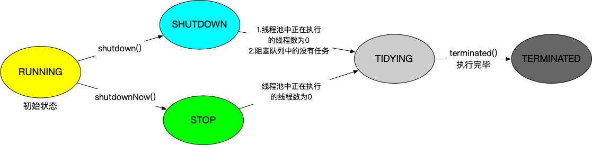

# 线程池

线程池是高并发中接触和使用较多的一项工具之一，本篇主要是进行ThreadPoolExecutor的源码分析， 没有太多的文字分析，详细步骤分析请查看代码中注释。


线程池使用，最简单的实例

```java
public class ThreadPoolTest {
    public static void main(String[] args) {
        // 核心参数如下：
        // 核心线程数、最大线程数、空闲后的存活时间、阻塞队列、线程工厂、拒绝策略处理
        ThreadPoolExecutor executor = new ThreadPoolExecutor(5, 10, 30, TimeUnit.SECONDS,
                new ArrayBlockingQueue<>(10), Executors.defaultThreadFactory(), new ThreadPoolExecutor.AbortPolicy());
        executor.execute(()->{
            System.out.println(123);
        });
    }
}
```


先来看其中几个重要**属性**。

```java
/**
 * 核心线程池大小.
 * 当一个线程被提交之后, 如果是小于corePoolSize, 将会创建一个新的线程用来执行, 即使线程池中的其他线程是空闲的,
 * 如果正在运行的线程数大于corePoolSize, 但小于maximumPoolSize, 只有队列是满的情况下才会去创建新的线程.
 */
private volatile int corePoolSize;
/**
 * 最大线程数
 */
private volatile int maximumPoolSize;
/**
 * 阻塞队列，用来存储等待执行的任务
 */
private final BlockingQueue<Runnable> workQueue;
/**
 * 此参数默认在线程数大于corePoolSize的情况下才会起作用， 当线程的空闲时间达到keepAliveTime的时候就会终止，
 * 直至线程数目小于corePoolSize。不过如果调用了allowCoreThreadTimeOut方法，则当线程数目小于corePoolSize的时候也会起作用.
 */
private volatile long keepAliveTime;
/**
 * 拒绝策略.
 * 当队列已经满了, 而此时如果还有新的任务进行提交, 就需要采用一种策略去处理新提交的任务.
 * 常用4中策略:
 *     AbortPolicy：直接丢弃并且抛出RejectedExecutionException异常
 *         CallerRunsPolicy：只用调用者所在线程来运行任务。
 *     DiscardOldestPolicy：丢弃队列里最近的一个任务，并执行当前任务。
 *     DiscardPolicy：丢弃任务并且不抛出异常。
 */
private volatile RejectedExecutionHandler handler;
```

使用不同的队列可以实现不一样的任务存取策略。在这里，我们可以再介绍**下阻塞队列**的成员：

| 名称                  | 描述                                                         |
| --------------------- | ------------------------------------------------------------ |
| ArrayBlockingQueue    | 由数组实现的FIFO有界阻塞队列。支持公平锁和非公平锁。         |
| LinkedBlockingQueue   | 由链表实现的FIFO有界对接，默认最大长度为Integer.MAX_VALUE。静态工厂方法Executors.newFixedThreadPool()就是使用了这个队列 |
| PriorityBlockingQueue | 优先级无界队列，必须手动指定comparator（或者去实现java.lang.Comparable接口），不然队列在内部排序会报错cannot be cast to java.lang.Comparable。 |
| SynchronousQueue      | 一个不存储元素的阻塞队列。每个插入操作必须等到另一个线程调用移除操作，否则插入操作一直处于阻塞状态，支持公平锁和非公平锁。吞吐量通常要高于LinkedBlockingQueue，静态工厂方法Executors.newCachedThreadPool()就使用了这个队列。 |
| DelayQueue            | 一个实现PriorityBlockingQueue延迟获取的无界队列，在创建元素时，可以指定多久才能从队列中获取当前元素。只有延时期满后才能从队列中获取元素。 |
| LinkedTransferQueue   | 一个由链表结构组成的无界队列，相对于其他的队列，LinkedTransferQueue队列多了transfer和tryTransfer方法。 |
| LinkedBlockingDeque   | 一个由链表实现的双向阻塞队列有界对接，默认最大长度为Integer.MAX_VALUE。队列头部和尾部可以添加和移除元素，多线程并发时，可以将锁的竞争最多降到一半。 |

 

接下来看如何进行**状态管理**:

```java
/**
 * 线程池的几种状态:
 * RUNNING:    接受新的任务, 处理队列中的任务
 * SHUTDOWN:   不接受新的任务, 但是处理队列中的任务
 * STOP:       不接受新任务, 不处理队列中的任务, 并且中断正在执行的任务
 * TIDYING:    所有的任务执行完了, 队列中的任务也是0，此时将会调用terminated()
 * TERMINATED: terminated()方法执行完毕       
 * 
 * 几种状态转化如下:
 * * RUNNING -> SHUTDOWN
 *    当显示调用shutdown(), 或者是隐显调用finalize()
 * (RUNNING or SHUTDOWN) -> STOP
 *    当执行shutdownNow()方法
 * SHUTDOWN -> TIDYING
 *    当线程池和队列都是空的时候
 * STOP -> TIDYING
 *    线程池是空的时候
 * TIDYING -> TERMINATED
 *    当terminated()方法执行完成之后
 * 
 * 状态码数值:
 * 状态高3位是状态位, 低29位是线程数
 */
// 初始状态RUNNING
private final AtomicInteger ctl = new AtomicInteger(ctlOf(RUNNING, 0));
// 29
private static final int COUNT_BITS = Integer.SIZE - 3;
// 00011111 11111111 11111111 11111111 --线程池最大数目
private static final int CAPACITY   = (1 << COUNT_BITS) - 1;
 
// runState is stored in the high-order bits
// 11100000 00000000 00000000 00000000
private static final int RUNNING    = -1 << COUNT_BITS;
// 00000000 00000000 00000000 00000000
private static final int SHUTDOWN   =  0 << COUNT_BITS;
// 00100000 00000000 00000000 00000000
private static final int STOP       =  1 << COUNT_BITS;
// 01000000 00000000 00000000 00000000
private static final int TIDYING    =  2 << COUNT_BITS;
// 01100000 00000000 00000000 00000000
private static final int TERMINATED =  3 << COUNT_BITS;
 
 
/**
 * 操作状态值有关相关方法
 */
// 取低29位线程池数量的值
private static int runStateOf(int c)     { return c & ~CAPACITY; }
// 取高3位状态码
private static int workerCountOf(int c)  { return c & CAPACITY; }
// 合并状态值
private static int ctlOf(int rs, int wc) { return rs | wc; }
```

**状态流转图**

 

在进行源码分析之前，我们先来看看代码**整体执行流程**


1.当有新的任务来的时候，直接创建新的去执行(如果不超过核心)。执行完后，阻塞队列进行获取任务继续执行。

2.如果已经超过核心线程数，此时任务进行入队进行缓冲，等待被执行。

3.如果阻塞队列满了，尝试开启最大线程数去执行任务。执行完，如果缓冲队列为空，回收线程（超过核心线程数的部分），否则阻塞队列进行获取任务，继续执行。

4.如果无法再添加线程，只能进行任务拒绝。


了解上述状态管理和线程中的几个重要属性之后， 下面直接开始分析**核心方法**

首先看核心方法**ThreadPoolExecutor#execute**

```java
public void execute(Runnable command) {
    if (command == null)
        throw new NullPointerException();
    /*
     * 流程分3步:
     * 
     * 1.如果运行的线程小于核心线程, 尝试去创建一个新的线程去执行该Runnable对象, 
     * 并将Runnable做为第一个任务, 调用addWorker()方法去原子性的检查线程池的状态和
     * 工作线程数, 以防止在false的时候添加了不应该添加的线程.
     * 
     * 2.如果任务成功的入队, 我们任然需要双向检查是否我们应该添加一个新的线程, 有
     * 可能添加的线程在前一次检查时已经死亡，又或者在进入该方法的时候线程池关闭了
     * 我们应该反复检查状态, 并且有必要的话回滚之前的入队操作或者是否应该停止入队
     *
     * 3.如果任务无法入列，那我们需要尝试新增一个线程，如果新建线程失败了，我们就
     * 知道线程可能关闭了或者饱和了，就需要拒绝这个任务
     */
    // 获取状态控制
    int c = ctl.get();
    // 当前线程池中的线程数小于核心线程则尝试去添加一个新的线程
    if (workerCountOf(c) < corePoolSize) {
        // 添加成功直接返回
        if (addWorker(command, true))
            return;
        // 获取线程池中的状态
        c = ctl.get();
    }
    // 如果线程池是运行状态, 尝试去入队
    if (isRunning(c) && workQueue.offer(command)) {
         // 再次获状态控制
        int recheck = ctl.get();
        // 如果不是运行状态(双向检查), 移除刚刚的入队操作
        if (! isRunning(recheck) && remove(command))
            // 拒绝策略
            reject(command);
        // 如果线程池中的线程数为0
        else if (workerCountOf(recheck) == 0)
            // 添加一个
            addWorker(null, false);
    }
    // 加入阻塞队列失败，则尝试以线程池最大线程数新开线程去执行该任务
    else if (!addWorker(command, false))
        // 执行失败则拒绝任务
        reject(command);
}
```

 

**ThreadPoolExecutor#addWorker**

```java
private boolean addWorker(Runnable firstTask, boolean core) {
    retry:
    for (;;) {
        // 获取状态控制
        int c = ctl.get();
        // 获取线程池的运行状态
        int rs = runStateOf(c);
 
        // Check if queue empty only if necessary.
        /*
         * 这里一段看的有点迷糊的小伙伴建议去再去看看线程池的几种状态.
         * (rs == SHUTDOWN && firstTask == null && ! workQueue.isEmpty())
         * 这一段逻辑可以结合SHUTDOWN状态理解去理解(不接受新的任务, 但是处理队列中的任务).
         *
         * 这里其实就限定了哪几种状态可以添加新的线程去执行任务:
         * 1.RUNNING
         * 2.SHUTDOWN状态, 没有新增的Runnable任务, 且阻塞队列中有值
         * 除开这两种状态，其他状态都是不允许新增新的线程去执行任务，就返回false
         */
        if (rs >= SHUTDOWN &&
            ! (rs == SHUTDOWN &&
               firstTask == null &&
               ! workQueue.isEmpty()))
            return false;
 
        for (;;) {
            // 线程池中的线程数
            int wc = workerCountOf(c);
            if (wc >= CAPACITY ||
                wc >= (core ? corePoolSize : maximumPoolSize))
                // 超过最大线程池数量；或者超过corePoolSize/maximumPoolSize
                return false;
            // 通过CAS操作，使workerCount数量+1，成功则跳出循环，回到retry标记
            if (compareAndIncrementWorkerCount(c))
                break retry;
            // CAS操作失败，再次获取线程池的整体控制状态
            c = ctl.get();  // Re-read ctl
            if (runStateOf(c) != rs)
                // 如果两次的线程池的运行状态不一致，重新进行外部循环
                continue retry;
            // CAS由于workerCount值改变失败, 重试内层循环
        }
    }
    // worker对象中的Runnable()对象的启动成功标识
    boolean workerStarted = false;
    // worker对象添加成功标识
    boolean workerAdded = false;
    Worker w = null;
    try {
        // 初始化一个当前Runnable对象的worker对象
        w = new Worker(firstTask);
        final Thread t = w.thread;
        if (t != null) {
            // 排他重入锁
            final ReentrantLock mainLock = this.mainLock;
            // 加锁
            mainLock.lock();
            try {
                // Recheck while holding lock.
                // Back out on ThreadFactory failure or if
                // shut down before lock acquired.
                // 获取线程池状态
                int rs = runStateOf(ctl.get());
                /*
                 * 线程池是RUNNING状态
                 * 线程池是SHUTDOWN状态并且没有新增的任务
                 */
                if (rs < SHUTDOWN ||
                    (rs == SHUTDOWN && firstTask == null)) {
                    // 线程是否存活
                    if (t.isAlive()) // precheck that t is startable
                        // //线程未启动就存活，抛出IllegalThreadStateException异常
                        throw new IllegalThreadStateException();
                    // 添加至workers集合，所以workers集合就是保存有哪些线程的变量
                    workers.add(w);
                    int s = workers.size();
                    /*
                     * 注意largestPoolSize和maximumPoolSize进行区分：
                     * largestPoolSize用来跟踪最大的池大小
                     * maximumPoolSize线程池最多能开启的线程数
                     */
                    if (s > largestPoolSize)
                        // 如果大小超过largestPoolSize，更新最大值
                        largestPoolSize = s;
                    // 标记worker已经被添加
                    workerAdded = true;
                }
            } finally {
                // 锁释放
                mainLock.unlock();
            }
            // 成功开启一个新的线程
            if (workerAdded) {
                // 启动线程
                t.start();
                // 标记worker已经启动
                workerStarted = true;
            }
        }
    } finally {
        if (! workerStarted)
            // 没有启动成功，执行addWorkerFailed()
            addWorkerFailed(w);
    }
    return workerStarted;
}
```


 下一步将会执行runWorker方法，不太明白如何执行到这里的同学可以去看下ThreadPoolExecutor#Worker类结构

**ThreadPoolExecutor#runWorker**

```java
final void runWorker(Worker w) {
    // 拿到当前线程
    Thread wt = Thread.currentThread();
    // 获取Worker中的Runnable对象
    Runnable task = w.firstTask;
    w.firstTask = null;
    /*
     * Worker对象继承了AbstractQueuedSynchronizer
     * 底层调用AQS的release方法释放锁
     */
    w.unlock(); // allow interrupts
    boolean completedAbruptly = true;
    try {
        /*
         * 这里其实就是不断轮询去执行队列中的任务了，
         * 首先尝试执行firstTask，若没有的话，则调用getTask()从队列中获取任务
         */
        while (task != null || (task = getTask()) != null) {
            // 加锁
            w.lock();
            // If pool is stopping, ensure thread is interrupted;
            // if not, ensure thread is not interrupted.  This
            // requires a recheck in second case to deal with
            // shutdownNow race while clearing interrupt
            /*
             * 线程池的状态是>=STOP状态
             * 线程是中断状态（清除中断状态）, 再次检查线程池的状态是>=STOP状态
             * 
             * 满足上述条件之一，再次检查是否是线程池是否是中断状态：
             * 若为非中断状态, 则标记该线程是中断状态
             */
            if ((runStateAtLeast(ctl.get(), STOP) ||
                 (Thread.interrupted() &&
                  runStateAtLeast(ctl.get(), STOP))) &&
                !wt.isInterrupted())
                wt.interrupt();
            try {
                // 执行前子类复写该方法进行调用--钩子
                beforeExecute(wt, task);
                Throwable thrown = null;
                try {
                    // Runnable对象的run方法执行
                    task.run();
                } catch (RuntimeException x) {
                    thrown = x; throw x;
                } catch (Error x) {
                    thrown = x; throw x;
                } catch (Throwable x) {
                    thrown = x; throw new Error(x);
                } finally {
                    // 执行后子类复写该方法进行调用--钩子
                    afterExecute(task, thrown);
                }
            } finally {
                // help gc
                task = null;
                // 已完成任务数+1
                w.completedTasks++;
                // 释放锁
                w.unlock();
            }
        }
        completedAbruptly = false;
    } finally {
        // 线程回收
        processWorkerExit(w, completedAbruptly);
    }
}
```

> 从这里我们就能看出如果Worker中没有任务，并且获取为空的任务，线程就会执行完；从这里你可能已经猜到，核心线程一直存活就是通过getTask()进行保证的，当maximumPoolSize >= Workers > corePoolSize，getTask() == null这里就能保证核心线程会部分回收
>


**ThreadPoolExecutor#getTask**获取阻塞队列中的任务

```java
private Runnable getTask() {
    boolean timedOut = false; // Did the last poll() time out?
 
    for (;;) {
        // 获取状态控制
        int c = ctl.get();
        // 获取线程池的状态
        int rs = runStateOf(c);
 
        // Check if queue empty only if necessary.
        /*
         * 1.如果状态是SHUTDOWN并且workQueue队列是空
         * 2.如果状态大于STOP
         */
        if (rs >= SHUTDOWN && (rs >= STOP || workQueue.isEmpty())) {
            // 工作的线程-1
            decrementWorkerCount();
            return null;
        }
        // 线程池中的线程数
        int wc = workerCountOf(c);
 
        // Are workers subject to culling?
        /* 
         * 如果设置了allowCoreThreadTimeOut(true), 核心线程超过keepAliveTime时间也会被回收
         * 否则以大于核心线程线程数作为判断
         */
        boolean timed = allowCoreThreadTimeOut || wc > corePoolSize;
        /*
         * 1.超过最大限制 || 超出的线程，并且获取任务超时
         * 2.工作线程数大于1或者阻塞队列不存在任务
         */
        if ((wc > maximumPoolSize || (timed && timedOut))
                       && (wc > 1 || workQueue.isEmpty())) {
            if (compareAndDecrementWorkerCount(c))
                // 线程池中的线程池数量-1
                return null;
            continue;
        }
 
        try {
            /*
             * 为true调用poll在keepAliveTime时间内去队列获取线程，如果没有获取到则为null
             * 否则调用take去队列获取线程，阻塞直到能获取线程
             */ 
            Runnable r = timed ?
                workQueue.poll(keepAliveTime, TimeUnit.NANOSECONDS) :
                workQueue.take();
            // 任务不为空
            if (r != null)
                return r;
            // 否则标记为超时
            timedOut = true;
        } catch (InterruptedException retry) {
            timedOut = false;
        }
    }
}
```

> 通过poll方法实现线程阻塞，确保小于corePoolSize的线程一直存活


**processWorkerExit**线程执行完毕的处理

```java
/**
 * getTask()为空就会进行后续处理，即对线程进行回收
 */
private void processWorkerExit(Worker w, boolean completedAbruptly) {
    if (completedAbruptly) // If abrupt, then workerCount wasn't adjusted
        // 如果是异常导致执行完毕，工作线程数减1
        decrementWorkerCount();
 
    final ReentrantLock mainLock = this.mainLock;
    // 加锁
    mainLock.lock();
    try {
        // 总的完成任务数加上该线程完成的任务数
        completedTaskCount += w.completedTasks;
        // workers移除该线程
        workers.remove(w);
    } finally {
        // 解锁
        mainLock.unlock();
    }
 
    tryTerminate();
 
    int c = ctl.get();
    // 状态是RUNNING或者SHUTDOWN
    if (runStateLessThan(c, STOP)) {
        if (!completedAbruptly) {
            int min = allowCoreThreadTimeOut ? 0 : corePoolSize;
            if (min == 0 && ! workQueue.isEmpty())
                // 当允许核心线程超时回收，且工作队列中还有任务的时候，设置最小线程保持个数为1
                min = 1;
            if (workerCountOf(c) >= min)
                // 当工作中的线程
                return; // replacement not needed
        }
        // 如果是异常导致，开启新线程去运行队列中的任务
        addWorker(null, false);
    }
}
```

 

**ThreadPoolExecutor#addWorkerFailed**如果是添加工作线程失败，执行逻辑如下

```java
/**
 * 将创建的线程回滚.
 * 工作线程存在就将其移出
 * 将工作线程从workers中移除
 */
private void addWorkerFailed(Worker w) {
    // 获取可重入锁
    final ReentrantLock mainLock = this.mainLock;
    // 加锁
    mainLock.lock();
    try {
        if (w != null)
            // 移除线程
            workers.remove(w);
        // 工作线程-1
        decrementWorkerCount();
        // 尝试去终止
        tryTerminate();
    } finally {
        mainLock.unlock();
    }
}
```

 

**ThreadPoolExecutor#tryTerminate**终止的方法逻辑

```java
/**
 * 转化到TERMINATED状态.
 * 如果线程池是SHUTDOWN状态并且线程池和队列都是空
 * 或者是STOP线程池是空
 */
final void tryTerminate() {
    for (;;) {
        int c = ctl.get();
       /*
        * 下面这三种状态直接return，结束执行
        * 1.线程池处于RUNNING状态
        * 2.线程池状态为TIDYING或者TERMINATED
        * 3.线程池==SHUTDOWN并且workQUeue不为空
        */
        if (isRunning(c) ||
            runStateAtLeast(c, TIDYING) ||
            (runStateOf(c) == SHUTDOWN && ! workQueue.isEmpty()))
            return;
        // 执行到这里线程池只剩下: 1.STOP状态，2.SHUTDOWN并且workQUeue为空
        if (workerCountOf(c) != 0) { // Eligible to terminate
            // 工作线程不为0
            // 打断工作线程
            interruptIdleWorkers(ONLY_ONE);
            return;
        }
        final ReentrantLock mainLock = this.mainLock;
        mainLock.lock();
      	/*
      	 * 下面的逻辑根据这两种状态去理解
         * TIDYING:    所有的任务执行完了, 队列中的任务也是0，此时将会调用terminated()
 				 * TERMINATED: terminated()方法执行完毕  
 				 */
        try {
            // 通过CAS操作，设置线程池状态为TIDYING
            if (ctl.compareAndSet(c, ctlOf(TIDYING, 0))) {
                try {
                    // 执行terminated()方法
                    terminated();
                } finally {
                    // 设置状态为TERMINATED
                    ctl.set(ctlOf(TERMINATED, 0));
                    termination.signalAll();
                }
                return;
            }
        } finally {
            mainLock.unlock();
        }
        // else retry on failed CAS
    }
}
```

**ThreadPoolExecutor#interruptIdleWorkers**

```java
/**
 * onlyOne为true只中断一个，否则全部中断
 */
private void interruptIdleWorkers(boolean onlyOne) {
    final ReentrantLock mainLock = this.mainLock;
    mainLock.lock();
    try {
        for (Worker w : workers) {
            Thread t = w.thread;
            if (!t.isInterrupted() && w.tryLock()) {
                try {
                    t.interrupt();
                } catch (SecurityException ignore) {
                } finally {
                    w.unlock();
                }
            }
            if (onlyOne)
                break;
        }
    } finally {
        mainLock.unlock();
    }
}
```

最后我们分析下线程池的关闭**ThreadPoolExecutor#shutdown**

```java
public void shutdown() {
    final ReentrantLock mainLock = this.mainLock;
    mainLock.lock();
    try {
        // 校验权限？
        checkShutdownAccess();
        // 更新线程池状态为shutdown
        advanceRunState(SHUTDOWN);
        interruptIdleWorkers();
        // 钩子方法
        onShutdown(); // hook for ScheduledThreadPoolExecutor
    } finally {
        mainLock.unlock();
    }
    // 尝试终止
    tryTerminate();
}
```

**ThreadPoolExecutor#advanceRunState**

```java
private void advanceRunState(int targetState) {
    for (;;) {
        int c = ctl.get();
        if (runStateAtLeast(c, targetState) ||
            ctl.compareAndSet(c, ctlOf(targetState, workerCountOf(c))))
            // 如果是>=shutdown状态 或者 成功变为shutdown状态
            break;
    }
}
```

**ThreadPoolExecutor#interruptIdleWorkers**中断所有线程（阻塞的将会被唤醒，抛出异常；非阻塞会被标记为中断）

```java
private void interruptIdleWorkers() {
  // 中断所有线程
  interruptIdleWorkers(false);
}
```

分析到这里整个RUNNING>>SHUTDOWN>>TINYING>>TERMINATED整个状态扭转都已经很清晰，但是STOP状态呢？shutdownNow()方法会涉及到这个状态。


下面继续**ThreadPoolExecutor#shutdownNow**

```java
  public List<Runnable> shutdownNow() {
    List<Runnable> tasks;
    final ReentrantLock mainLock = this.mainLock;
    mainLock.lock();
    try {
        // 校验权限？
        checkShutdownAccess();
        // 更新线程池状态为stop
        advanceRunState(STOP);
        // 中断正在执行的任务
        interruptWorkers();
        // 移除阻塞队列中所以任务
        tasks = drainQueue();
    } finally {
        mainLock.unlock();
    }
    // 尝试终止
    tryTerminate();
    return tasks;
}
```

**ThreadPoolExecutor#interruptWorkers**进行中断线程

```java
private void interruptWorkers() {
    final ReentrantLock mainLock = this.mainLock;
    // 加锁
    mainLock.lock();
    try {
        for (Worker w : workers)
            w.interruptIfStarted();
    } finally {
        mainLock.unlock();
    }
}
```

**ThreadPoolExecutor.Worker#interruptIfStarted**

```java
void interruptIfStarted() {
    Thread t;
    if (getState() >= 0 && (t = thread) != null && !t.isInterrupted()) {
        // running状态或者shutdown状态，线程不为空 && 线程没有标记为中断状态
        try {
            // 标记线程为中断状态
            t.interrupt();
        } catch (SecurityException ignore) {
        }
    }
}
```

**ThreadPoolExecutor#drainQueue**

```java
/**
 * 通常使用drainTo将任务队列排放到新列表中。 
 * 但是，如果队列是DelayQueue或其他类型的队列，poll或drainTo可能无法删除某些元素，则将其逐个删除。
 */
private List<Runnable> drainQueue() {
    BlockingQueue<Runnable> q = workQueue;
    ArrayList<Runnable> taskList = new ArrayList<Runnable>();
    q.drainTo(taskList);
    if (!q.isEmpty()) {
        for (Runnable r : q.toArray(new Runnable[0])) {
            if (q.remove(r))
                taskList.add(r);
        }
    }
    return taskList;
}
```

这里总结一下shutdownNow()方法，先更新线程状态为STOP，然后将线程池中的线程标记为中断状态，接着移除队列中的任务。

参考资料: [Java线程池实现原理及其在美团业务中的实践](https://tech.meituan.com/2020/04/02/java-pooling-pratice-in-meituan.html)
