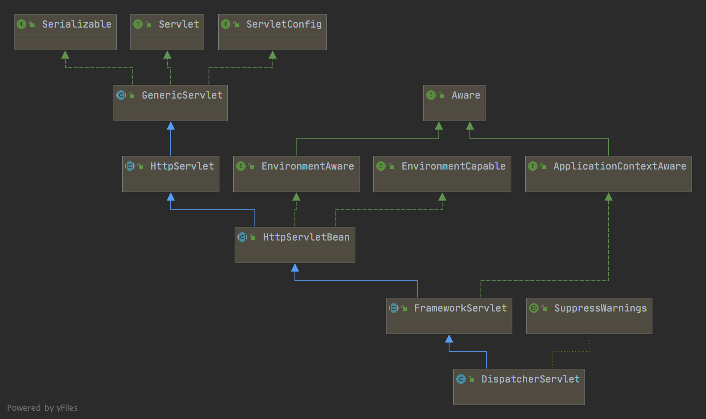
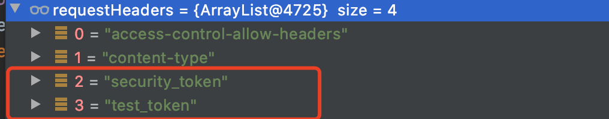

# SpringMVC执行流程

上一篇我们已经介绍了SpringMVC的初始化流程，本篇开始介绍SpringMVC执行流程。

开始进行源码分析之前，再次来回顾一下DispatcherServlet类图



> DispatcherServlet继承于HttpServlet
>
> FrameworkServlet中定义了所有的service、doGet、doPost、doPut、doDelete、doOptions、doTrace的相关方法


这里以get请求为例子，下面我们开始进行源码分析

FrameworkServlet#doGet

```java
@Override
protected final void doGet(HttpServletRequest request, HttpServletResponse response)
      throws ServletException, IOException {

   processRequest(request, response);
}
```

FrameworkServlet#processRequest

```java
protected final void processRequest(HttpServletRequest request, HttpServletResponse response)
      throws ServletException, IOException {

   long startTime = System.currentTimeMillis();
   Throwable failureCause = null;

   LocaleContext previousLocaleContext = LocaleContextHolder.getLocaleContext();
   LocaleContext localeContext = buildLocaleContext(request);

   RequestAttributes previousAttributes = RequestContextHolder.getRequestAttributes();
   ServletRequestAttributes requestAttributes = buildRequestAttributes(request, response, previousAttributes);

   WebAsyncManager asyncManager = WebAsyncUtils.getAsyncManager(request);
   asyncManager.registerCallableInterceptor(FrameworkServlet.class.getName(), new RequestBindingInterceptor());

   initContextHolders(request, localeContext, requestAttributes);

   try {
      doService(request, response);
   }
   catch (ServletException | IOException ex) {
      failureCause = ex;
      throw ex;
   }
   catch (Throwable ex) {
      failureCause = ex;
      throw new NestedServletException("Request processing failed", ex);
   }

   finally {
      resetContextHolders(request, previousLocaleContext, previousAttributes);
      if (requestAttributes != null) {
         requestAttributes.requestCompleted();
      }
      logResult(request, response, failureCause, asyncManager);
      publishRequestHandledEvent(request, response, startTime, failureCause);
   }
}
```

DispatcherServlet#doService

```java
@Override
protected void doService(HttpServletRequest request, HttpServletResponse response) throws Exception {
   logRequest(request);

   // Keep a snapshot of the request attributes in case of an include,
   // to be able to restore the original attributes after the include.
   // 如果包含，请保留请求属性的快照，
   // 以便在包含之后恢复原始属性。
   Map<String, Object> attributesSnapshot = null;
   if (WebUtils.isIncludeRequest(request)) {
      attributesSnapshot = new HashMap<>();
      Enumeration<?> attrNames = request.getAttributeNames();
      while (attrNames.hasMoreElements()) {
         String attrName = (String) attrNames.nextElement();
         if (this.cleanupAfterInclude || attrName.startsWith(DEFAULT_STRATEGIES_PREFIX)) {
            attributesSnapshot.put(attrName, request.getAttribute(attrName));
         }
      }
   }

   // Make framework objects available to handlers and view objects.
   // 设置一些请求的处理器
   request.setAttribute(WEB_APPLICATION_CONTEXT_ATTRIBUTE, getWebApplicationContext());
   request.setAttribute(LOCALE_RESOLVER_ATTRIBUTE, this.localeResolver);
   request.setAttribute(THEME_RESOLVER_ATTRIBUTE, this.themeResolver);
   request.setAttribute(THEME_SOURCE_ATTRIBUTE, getThemeSource());

   if (this.flashMapManager != null) {
      FlashMap inputFlashMap = this.flashMapManager.retrieveAndUpdate(request, response);
      if (inputFlashMap != null) {
         request.setAttribute(INPUT_FLASH_MAP_ATTRIBUTE, Collections.unmodifiableMap(inputFlashMap));
      }
      request.setAttribute(OUTPUT_FLASH_MAP_ATTRIBUTE, new FlashMap());
      request.setAttribute(FLASH_MAP_MANAGER_ATTRIBUTE, this.flashMapManager);
   }

   try {
      // 重点关注这个
      doDispatch(request, response);
   }
   finally {
      if (!WebAsyncUtils.getAsyncManager(request).isConcurrentHandlingStarted()) {
         // Restore the original attribute snapshot, in case of an include.
         if (attributesSnapshot != null) {
            restoreAttributesAfterInclude(request, attributesSnapshot);
         }
      }
   }
}
```

DispatcherServlet#doDispatch

```java
protected void doDispatch(HttpServletRequest request, HttpServletResponse response) throws Exception {
   HttpServletRequest processedRequest = request;
   HandlerExecutionChain mappedHandler = null;
   boolean multipartRequestParsed = false;

   WebAsyncManager asyncManager = WebAsyncUtils.getAsyncManager(request);

   try {
      ModelAndView mv = null;
      Exception dispatchException = null;

      try {
         // 文件上传解析，如果请求类型是multipart将通过MultipartResolver进行文件上传解析
         processedRequest = checkMultipart(request);
         multipartRequestParsed = (processedRequest != request);

         // Determine handler for the current request.
         // 确定当前请求的处理程序
         mappedHandler = getHandler(processedRequest);
         if (mappedHandler == null) {
            // 没有找到处理方法直接抛出异常
            noHandlerFound(processedRequest, response);
            return;
         }

         // Determine handler adapter for the current request.
         // 获取处理适配器
         HandlerAdapter ha = getHandlerAdapter(mappedHandler.getHandler());

         // Process last-modified header, if supported by the handler.
         // 如果处理程序支持，则处理最后修改的头文件
         String method = request.getMethod();
         boolean isGet = "GET".equals(method);
         if (isGet || "HEAD".equals(method)) {
            long lastModified = ha.getLastModified(request, mappedHandler.getHandler());
            if (new ServletWebRequest(request, response).checkNotModified(lastModified) && isGet) {
               return;
            }
         }
				 // 执行拦截器
         if (!mappedHandler.applyPreHandle(processedRequest, response)) {
            return;
         }

         // Actually invoke the handler.
         // 正在开始执行处理器
         mv = ha.handle(processedRequest, response, mappedHandler.getHandler());

         if (asyncManager.isConcurrentHandlingStarted()) {
            return;
         }

         applyDefaultViewName(processedRequest, mv);
         mappedHandler.applyPostHandle(processedRequest, response, mv);
      }
      catch (Exception ex) {
         dispatchException = ex;
      }
      catch (Throwable err) {
         // As of 4.3, we're processing Errors thrown from handler methods as well,
         // making them available for @ExceptionHandler methods and other scenarios.
         dispatchException = new NestedServletException("Handler dispatch failed", err);
      }
      processDispatchResult(processedRequest, response, mappedHandler, mv, dispatchException);
   }
   catch (Exception ex) {
      triggerAfterCompletion(processedRequest, response, mappedHandler, ex);
   }
   catch (Throwable err) {
      triggerAfterCompletion(processedRequest, response, mappedHandler,
            new NestedServletException("Handler processing failed", err));
   }
   finally {
      if (asyncManager.isConcurrentHandlingStarted()) {
         // Instead of postHandle and afterCompletion
         if (mappedHandler != null) {
            mappedHandler.applyAfterConcurrentHandlingStarted(processedRequest, response);
         }
      }
      else {
         // Clean up any resources used by a multipart request.
         if (multipartRequestParsed) {
            cleanupMultipart(processedRequest);
         }
      }
   }
}
```


#### 文上传demo

这里我们以StandardServletMultipartResolver这种方式为例（必须使用支持Servlet3.0的容器才可以），CommonsMultipartResolver这种方法这里不做讲解。

需以StandardServletMultipartResolver方式实现文件上传，创建一个StandardServletMultipartResolver做为bean

```java
@Bean
public MultipartResolver multipartResolver(){
    return new StandardServletMultipartResolver();
}
```


### **文件上传解析源码分析**

接着上文的doDispatch进行分析，调用checkMultipart进行文件上传解析。

DispatcherServlet#checkMultipart

```java
protected HttpServletRequest checkMultipart(HttpServletRequest request) throws MultipartException {
   // multipartResolver解析器不为空 && ContentType是以multipart/开头的
   if (this.multipartResolver != null && this.multipartResolver.isMultipart(request)) {
      // 请求类型是MultipartHttpServletRequest类型
      if (WebUtils.getNativeRequest(request, MultipartHttpServletRequest.class) != null) {
         if (request.getDispatcherType().equals(DispatcherType.REQUEST)) {
            logger.trace("Request already resolved to MultipartHttpServletRequest, e.g. by MultipartFilter");
         }
      }
      else if (hasMultipartException(request)) {
         logger.debug("Multipart resolution previously failed for current request - " +
               "skipping re-resolution for undisturbed error rendering");
      }
      else {
         try {
            return this.multipartResolver.resolveMultipart(request);
         }
         catch (MultipartException ex) {
            if (request.getAttribute(WebUtils.ERROR_EXCEPTION_ATTRIBUTE) != null) {
               logger.debug("Multipart resolution failed for error dispatch", ex);
               // Keep processing error dispatch with regular request handle below
            }
            else {
               throw ex;
            }
         }
      }
   }
   // If not returned before: return original request.
   return request;
}
```

StandardServletMultipartResolver#resolveMultipart

```java
@Override
public MultipartHttpServletRequest resolveMultipart(HttpServletRequest request) throws MultipartException {
   return new StandardMultipartHttpServletRequest(request, this.resolveLazily);
}
```

#StandardMultipartHttpServletRequest构造方法

```java
public StandardMultipartHttpServletRequest(HttpServletRequest request, boolean lazyParsing)
      throws MultipartException {
	 // 进行request赋值
   super(request);
   if (!lazyParsing) {
      parseRequest(request);
   }
}
```

StandardMultipartHttpServletRequest#parseRequest

```java
private void parseRequest(HttpServletRequest request) {
   try {
      // 调用servlet方法进行文件获取
      Collection<Part> parts = request.getParts();
      this.multipartParameterNames = new LinkedHashSet<>(parts.size());
      MultiValueMap<String, MultipartFile> files = new LinkedMultiValueMap<>(parts.size());
      for (Part part : parts) {
         // 获取文件头中的Content-Disposition属性
         String headerValue = part.getHeader(HttpHeaders.CONTENT_DISPOSITION);
         // 解析为ContentDisposition对象
         ContentDisposition disposition = ContentDisposition.parse(headerValue);
         // 获取文件名称
         String filename = disposition.getFilename();
         if (filename != null) {
            if (filename.startsWith("=?") && filename.endsWith("?=")) {
               filename = MimeDelegate.decode(filename);
            }
            files.add(part.getName(), new StandardMultipartFile(part, filename));
         }
         else {
            // 添加字段名称
            this.multipartParameterNames.add(part.getName());
         }
      }
      // 设置multipartFiles
      setMultipartFiles(files);
   }
   catch (Throwable ex) {
      handleParseFailure(ex);
   }
}
```

AbstractMultipartHttpServletRequest#setMultipartFiles

```java
protected final void setMultipartFiles(MultiValueMap<String, MultipartFile> multipartFiles) {
   this.multipartFiles =
         new LinkedMultiValueMap<>(Collections.unmodifiableMap(multipartFiles));
}
```

> 最终解析出来的文件会放置在StandardMultipartHttpServletRequest的父类multipartFiles变量中


### 获取执行器

DispatcherServlet#getHandler

```java
@Nullable
protected HandlerExecutionChain getHandler(HttpServletRequest request) throws Exception {
   if (this.handlerMappings != null) {
      // handlerMappings含有三个HandlerMapping
      // BeanNameUrlHandlerMapping、RequestMappingHandlerMapping、RouterFunctionMapping(web_flux这里不做讲解)
      // 首先执行的是RequestMappingHandlerMapping
      for (HandlerMapping mapping : this.handlerMappings) {
         HandlerExecutionChain handler = mapping.getHandler(request);
         if (handler != null) {
            return handler;
         }
      }
   }
   return null;
}
```

> AbstractHandlerMapping继承关系如下：
>
> ​    AbstractHandlerMapping(org.springframework.web.servlet.handler)
> ​      AbstractUrlHandlerMapping (org.springframework.web.servlet.handler)
> ​        AbstractDetectingUrlHandlerMapping (org.springframework.web.servlet.handler)
> ​          **BeanNameUrlHandlerMapping (org.springframework.web.servlet.handler)**
> ​        SimpleUrlHandlerMapping (org.springframework.web.servlet.handler)
> ​      AbstractHandlerMethodMapping (org.springframework.web.servlet.handler)
> ​        RequestMappingInfoHandlerMapping (org.springframework.web.servlet.mvc.method)
> ​          **RequestMappingHandlerMapping (org.springframework.web.servlet.mvc.method.annotation)** --重点关注这个
> ​      **RouterFunctionMapping (org.springframework.web.servlet.function.support)**

RequestMappingHandlerMapping的父类是AbstractHandlerMapping，调用的是其父类的方法

AbstractHandlerMapping#getHandler

```java
@Override
@Nullable
public final HandlerExecutionChain getHandler(HttpServletRequest request) throws Exception {
   // 获取处理器（@Controller类上面匹配到的方法）RequestMappingHandlerMapping返回的为HandlerMethod对象
   Object handler = getHandlerInternal(request);
   if (handler == null) {
      // 获取默认的处理器
      handler = getDefaultHandler();
   }
   if (handler == null) {
      return null;
   }
   // Bean name or resolved handler?
   if (handler instanceof String) {
      String handlerName = (String) handler;
      handler = obtainApplicationContext().getBean(handlerName);
   }
   // 获取执行调用链（添加拦截器）
   HandlerExecutionChain executionChain = getHandlerExecutionChain(handler, request);

   if (logger.isTraceEnabled()) {
      logger.trace("Mapped to " + handler);
   }
   else if (logger.isDebugEnabled() && !request.getDispatcherType().equals(DispatcherType.ASYNC)) {
      logger.debug("Mapped to " + executionChain.getHandler());
   }
	 // WebMvcConfigurer子类中配置的跨越不为空 || 浏览器发起的PreFlight请求
   if (hasCorsConfigurationSource(handler) || CorsUtils.isPreFlightRequest(request)) {
      // 先去获取WebMvcConfigurer中的跨越配置
      CorsConfiguration config = (this.corsConfigurationSource != null ? this.corsConfigurationSource.getCorsConfiguration(request) : null);
      // 再去获取方法上已经解析好了的@CrossOrigin配置
      CorsConfiguration handlerConfig = getCorsConfiguration(handler, request);
      // 进行合并
      config = (config != null ? config.combine(handlerConfig) : handlerConfig);
      // 获取跨域请求调用链
      executionChain = getCorsHandlerExecutionChain(request, executionChain, config);
   }

   return executionChain;
}
```

> 所有注释中的@Controller其实帮助理解， 实际上是被spring定义为bean，即为习惯性注解，而不是语义性注解。

AbstractHandlerMapping#getHandlerInternal

```java
@Override
protected HandlerMethod getHandlerInternal(HttpServletRequest request) throws Exception {
   request.removeAttribute(PRODUCIBLE_MEDIA_TYPES_ATTRIBUTE);
   try {
      // 获取HandlerMethod
      return super.getHandlerInternal(request);
   }
   finally {
      ProducesRequestCondition.clearMediaTypesAttribute(request);
   }
}
```

调用父类AbstractHandlerMethodMapping#getHandlerInternal

```java
@Override
protected HandlerMethod getHandlerInternal(HttpServletRequest request) throws Exception {
   // 获取请求路径
   String lookupPath = getUrlPathHelper().getLookupPathForRequest(request);
   request.setAttribute(LOOKUP_PATH, lookupPath);
   // 加读锁
   this.mappingRegistry.acquireReadLock();
   try {
      // 获取方法处理器
      HandlerMethod handlerMethod = lookupHandlerMethod(lookupPath, request);
      return (handlerMethod != null ? handlerMethod.createWithResolvedBean() : null);
   }
   finally {
      // 读锁释放
      this.mappingRegistry.releaseReadLock();
   }
}
```


#### 获取处理后的请求路径

UrlPathHelper#getLookupPathForRequest

```java
public String getLookupPathForRequest(HttpServletRequest request) {
   // Always use full path within current servlet context?
   // 是否总是用全路径去匹配
   // 默认值为false
   if (this.alwaysUseFullPath) {
      return getPathWithinApplication(request);
   }
   // Else, use path within current servlet mapping if applicable
   String rest = getPathWithinServletMapping(request);
   if (!"".equals(rest)) {
      return rest;
   }
   else {
      return getPathWithinApplication(request);
   }
}
```

> alwaysUseFullPath = false的时候， 会移除servletPath的部分进行匹配

UrlPathHelper#getPathWithinApplication

```java
public String getPathWithinApplication(HttpServletRequest request) {
    // 获取contextPath
		String contextPath = getContextPath(request);
    // 获取requestUri
		String requestUri = getRequestUri(request);
    // 获取requestUri中不包含contextPath的部分
    // contextPath -> /test  requestUri -> /test/abc
    // getRemainingPath(requestUri, contextPath, true); -> /abc
		String path = getRemainingPath(requestUri, contextPath, true);
		if (path != null) {
			// Normal case: URI contains context path.
			return (StringUtils.hasText(path) ? path : "/");
		}
		else {
			return requestUri;
		}
}
```

UrlPathHelper#getContextPath

```java
public String getContextPath(HttpServletRequest request) {
   // 获取contextPath
   String contextPath = (String) request.getAttribute(WebUtils.INCLUDE_CONTEXT_PATH_ATTRIBUTE);
   if (contextPath == null) {
      contextPath = request.getContextPath();
   }
   // contextPath为'/'
   if ("/".equals(contextPath)) {
      // Invalid case, but happens for includes on Jetty: silently adapt it.
      // 无效的情况，但发生在Jetty上的包含项：默默地适应它。
      contextPath = "";
   }
   return decodeRequestString(request, contextPath);
}
```

UrlPathHelper#decodeRequestString

```java
public String decodeRequestString(HttpServletRequest request, String source) {
   // 默认值为true
   if (this.urlDecode) {
      // 进行编码
      return decodeInternal(request, source);
   }
   return source;
}
```

UrlPathHelper#decodeInternal

```java
private String decodeInternal(HttpServletRequest request, String source) {
   String enc = determineEncoding(request);
   try {
      // 进行编码
      return UriUtils.decode(source, enc);
   }
   catch (UnsupportedCharsetException ex) {
      if (logger.isWarnEnabled()) {
         logger.warn("Could not decode request string [" + source + "] with encoding '" + enc +
               "': falling back to platform default encoding; exception message: " + ex.getMessage());
      }
      return URLDecoder.decode(source);
   }
}
```

UrlPathHelper#determineEncoding

```java
protected String determineEncoding(HttpServletRequest request) {
   // 从request中获取字符编码
   String enc = request.getCharacterEncoding();
   if (enc == null) {
      // 获取默认的编码"ISO-8859-1"
      enc = getDefaultEncoding();
   }
   return enc;
}
```

UrlPathHelper#getRequestUri

```java
public String getRequestUri(HttpServletRequest request) {
   // 获取uri
   String uri = (String) request.getAttribute(WebUtils.INCLUDE_REQUEST_URI_ATTRIBUTE);
   if (uri == null) {
      uri = request.getRequestURI();
   }
   // 编码并清理uri字符串
   return decodeAndCleanUriString(request, uri);
}
```

UrlPathHelper#decodeAndCleanUriString

```java
private String decodeAndCleanUriString(HttpServletRequest request, String uri) {
   // 对提供的URI字符串进行解码，并在";"后面去掉任何无关部
   uri = removeSemicolonContent(uri);
   // 进行编码
   uri = decodeRequestString(request, uri);
   // 替换所有"//"为"/"
   uri = getSanitizedPath(uri);
   return uri;
}
```

UrlPathHelper#decodeAndCleanUriString

```java
public String removeSemicolonContent(String requestUri) {
   // removeSemicolonContent默认为true移除所有';'后面的字符串 否则 移除";jsessionid="
   return (this.removeSemicolonContent ?
         removeSemicolonContentInternal(requestUri) : removeJsessionid(requestUri));
}
```

UrlPathHelper#removeSemicolonContentInternal

```java
/**
 * 移除所有';'后面的字符串
 * /ab;c;d -> /ab
 */
private String removeSemicolonContentInternal(String requestUri) {
   int semicolonIndex = requestUri.indexOf(';');
   while (semicolonIndex != -1) {
      int slashIndex = requestUri.indexOf('/', semicolonIndex);
      String start = requestUri.substring(0, semicolonIndex);
      requestUri = (slashIndex != -1) ? start + requestUri.substring(slashIndex) : start;
      semicolonIndex = requestUri.indexOf(';', semicolonIndex);
   }
   return requestUri;
}
```

UrlPathHelper#getRemainingPath

```java
/**
 * requestUri -> /test
 * mapping -> /test/abc
 * getRemainingPath(requestUri, contextPath, true); -> /abc
 */
@Nullable
private String getRemainingPath(String requestUri, String mapping, boolean ignoreCase) {
   int index1 = 0;
   int index2 = 0;
   for (; (index1 < requestUri.length()) && (index2 < mapping.length()); index1++, index2++) {
      char c1 = requestUri.charAt(index1);
      char c2 = mapping.charAt(index2);
      if (c1 == ';') {
         index1 = requestUri.indexOf('/', index1);
         if (index1 == -1) {
            return null;
         }
         c1 = requestUri.charAt(index1);
      }
      if (c1 == c2 || (ignoreCase && (Character.toLowerCase(c1) == Character.toLowerCase(c2)))) {
         continue;
      }
      return null;
   }
   if (index2 != mapping.length()) {
      return null;
   }
   else if (index1 == requestUri.length()) {
      return "";
   }
   else if (requestUri.charAt(index1) == ';') {
      index1 = requestUri.indexOf('/', index1);
   }
   return (index1 != -1 ? requestUri.substring(index1) : "");
}
```

UrlPathHelper#getPathWithinServletMapping

```java
/**
 * 获取路径
 * <p>E.g.: servlet mapping = "/*"; request URI = "/test/a" -> "/test/a".
 * <p>E.g.: servlet mapping = "/"; request URI = "/test/a" -> "/test/a".
 * <p>E.g.: servlet mapping = "/test/*"; request URI = "/test/a" -> "/a".
 * <p>E.g.: servlet mapping = "/test"; request URI = "/test" -> "".
 * <p>E.g.: servlet mapping = "/*.test"; request URI = "/a.test" -> "".
 */
public String getPathWithinServletMapping(HttpServletRequest request) {
   // 获取uri中不包含contextPath的部分
   String pathWithinApp = getPathWithinApplication(request);
   // 获取servletPath
   String servletPath = getServletPath(request);
   // replace all "//" by "/"
   String sanitizedPathWithinApp = getSanitizedPath(pathWithinApp);
   String path;
	
   // If the app container sanitized the servletPath, check against the sanitized version
   /*
    * 若contextPath为"/test"
    * servletMappings为"/asd/*"
    * 请求为"http://localhost:8080/test/asd/abc"
    * 此时servletPath为"/asd"
    * 下面会进行截取
    */
   if (servletPath.contains(sanitizedPathWithinApp)) {
      path = getRemainingPath(sanitizedPathWithinApp, servletPath, false);
   }
   else {
      // 获得"/abc"
      path = getRemainingPath(pathWithinApp, servletPath, false);
   }

   if (path != null) {
      // Normal case: URI contains servlet path.
      return path;
   }
   else {
      // Special case: URI is different from servlet path.
      String pathInfo = request.getPathInfo();
      if (pathInfo != null) {
         // Use path info if available. Indicates index page within a servlet mapping?
         // e.g. with index page: URI="/", servletPath="/index.html"
         return pathInfo;
      }
      if (!this.urlDecode) {
         // No path info... (not mapped by prefix, nor by extension, nor "/*")
         // For the default servlet mapping (i.e. "/"), urlDecode=false can
         // cause issues since getServletPath() returns a decoded path.
         // If decoding pathWithinApp yields a match just use pathWithinApp.
         path = getRemainingPath(decodeInternal(request, pathWithinApp), servletPath, false);
         if (path != null) {
            return pathWithinApp;
         }
      }
      // Otherwise, use the full servlet path.
      return servletPath;
   }
}
```

UrlPathHelper#getSanitizedPath

```java
/**
 * replace all "//" by "/"
 */
private String getSanitizedPath(final String path) {
   String sanitized = path;
   while (true) {
      int index = sanitized.indexOf("//");
      if (index < 0) {
         break;
      }
      else {
         sanitized = sanitized.substring(0, index) + sanitized.substring(index + 1);
      }
   }
   return sanitized;
}
```


RequestMappingHandlerMapping处理完请求路径后，接下来继续关注如何**获取HandlerMethod**。

AbstractHandlerMethodMapping#lookupHandlerMethod

```java
@Nullable
protected HandlerMethod lookupHandlerMethod(String lookupPath, HttpServletRequest request) throws Exception {
   List<Match> matches = new ArrayList<>();
   // 获取直接匹配的路径，这里是直接根据请求连接进行匹配
   List<T> directPathMatches = this.mappingRegistry.getMappingsByUrl(lookupPath);
   if (directPathMatches != null) {
      // 获取匹配路由添加到matches变量中
      addMatchingMappings(directPathMatches, matches, request);
   }
   if (matches.isEmpty()) {
      // No choice but to go through all mappings...
      addMatchingMappings(this.mappingRegistry.getMappings().keySet(), matches, request);
   }

   if (!matches.isEmpty()) {
      Match bestMatch = matches.get(0);
      if (matches.size() > 1) {
         Comparator<Match> comparator = new MatchComparator(getMappingComparator(request));
         matches.sort(comparator);
         bestMatch = matches.get(0);
         if (logger.isTraceEnabled()) {
            logger.trace(matches.size() + " matching mappings: " + matches);
         }
         if (CorsUtils.isPreFlightRequest(request)) {
            return PREFLIGHT_AMBIGUOUS_MATCH;
         }
         Match secondBestMatch = matches.get(1);
         if (comparator.compare(bestMatch, secondBestMatch) == 0) {
            Method m1 = bestMatch.handlerMethod.getMethod();
            Method m2 = secondBestMatch.handlerMethod.getMethod();
            String uri = request.getRequestURI();
            throw new IllegalStateException(
                  "Ambiguous handler methods mapped for '" + uri + "': {" + m1 + ", " + m2 + "}");
         }
      }
      request.setAttribute(BEST_MATCHING_HANDLER_ATTRIBUTE, bestMatch.handlerMethod);
      handleMatch(bestMatch.mapping, lookupPath, request);
      return bestMatch.handlerMethod;
   }
   else {
      return handleNoMatch(this.mappingRegistry.getMappings().keySet(), lookupPath, request);
   }
}
```


AbstractHandlerMapping#getHandlerExecutionChain

```java
protected HandlerExecutionChain getHandlerExecutionChain(Object handler, HttpServletRequest request) {
   HandlerExecutionChain chain = (handler instanceof HandlerExecutionChain ?
         (HandlerExecutionChain) handler : new HandlerExecutionChain(handler));

   String lookupPath = this.urlPathHelper.getLookupPathForRequest(request, LOOKUP_PATH);
   // 获取拦截器
   for (HandlerInterceptor interceptor : this.adaptedInterceptors) {
      if (interceptor instanceof MappedInterceptor) {
         // 为MappedInterceptor则进行matches匹配
         MappedInterceptor mappedInterceptor = (MappedInterceptor) interceptor;
         if (mappedInterceptor.matches(lookupPath, this.pathMatcher)) {
            // 匹配上就添加
            chain.addInterceptor(mappedInterceptor.getInterceptor());
         }
      }
      else {
         // 否则直接进行添加
         chain.addInterceptor(interceptor);
      }
   }
   return chain;
}
```

> ```java
> /**
>  * @EnableWebMvc该注解必须有
>  */
> @EnableWebMvc
> @Configuration
> public class WebConfiguration implements WebMvcConfigurer {
>     @Override
>     public void addInterceptors(InterceptorRegistry registry) {
>         /*
>          * 拦截器可以用order去定义执行顺序
>          */
>         registry.addInterceptor(testInterceptor()).addPathPatterns("/**").order(-1);
>     }
> }
> ```
>
> 添加拦截器方式


**处理跨域请求**

AbstractHandlerMethodMapping#hasCorsConfigurationSource

```java
@Override
protected boolean hasCorsConfigurationSource(Object handler) {
   return super.hasCorsConfigurationSource(handler) ||
         (handler instanceof HandlerMethod && this.mappingRegistry.getCorsConfiguration((HandlerMethod) handler) != null);
}
```

AbstractHandlerMapping#hasCorsConfigurationSource

```java
protected boolean hasCorsConfigurationSource(Object handler) {
   if (handler instanceof HandlerExecutionChain) {
      handler = ((HandlerExecutionChain) handler).getHandler();
   }
   return (handler instanceof CorsConfigurationSource || this.corsConfigurationSource != null);
}
```

AbstractHandlerMethodMapping#getCorsConfiguration

```java
@Nullable
public CorsConfiguration getCorsConfiguration(HandlerMethod handlerMethod) {
   HandlerMethod original = handlerMethod.getResolvedFromHandlerMethod();
   return this.corsLookup.get(original != null ? original : handlerMethod);
}
```

> corsLookup中key为HandlerMethod，value为CorsConfiguration

CorsUtils#isPreFlightRequest

```java
public static boolean isPreFlightRequest(HttpServletRequest request) {
   // OPTION请求 && header中的Origin不为空 && header中的Access-Control-Request-Method不为空
   return (HttpMethod.OPTIONS.matches(request.getMethod()) &&
         request.getHeader(HttpHeaders.ORIGIN) != null &&
         request.getHeader(HttpHeaders.ACCESS_CONTROL_REQUEST_METHOD) != null);
}
```

UrlBasedCorsConfigurationSource#getCorsConfiguration获取

```java
@Override
@Nullable
public CorsConfiguration getCorsConfiguration(HttpServletRequest request) {
   // 获取匹配路径，先去request获取，获取不到就进行解析
   String lookupPath = this.urlPathHelper.getLookupPathForRequest(request, this.lookupPathAttributeName);
   for (Map.Entry<String, CorsConfiguration> entry : this.corsConfigurations.entrySet()) {
      // 如果路径能匹配上
      if (this.pathMatcher.match(entry.getKey(), lookupPath)) {
         // 返回跨域配置
         return entry.getValue();
      }
   }
   return null;
}
```

AbstractHandlerMethodMapping#getCorsConfiguration

```java
@Override
protected CorsConfiguration getCorsConfiguration(Object handler, HttpServletRequest request) {
   // 调用父类去获取配置类
   CorsConfiguration corsConfig = super.getCorsConfiguration(handler, request);
   // 正常逻辑是HandlerMethod
   if (handler instanceof HandlerMethod) {
      HandlerMethod handlerMethod = (HandlerMethod) handler;
      // 是否为空的handler
      if (handlerMethod.equals(PREFLIGHT_AMBIGUOUS_MATCH)) {
         return AbstractHandlerMethodMapping.ALLOW_CORS_CONFIG;
      }
      else {
         // mappingRegistry中key为HandlerMethod，value为CorsConfiguration
         // 获取已经解析好的@CrossOrigin上面的配置
         CorsConfiguration corsConfigFromMethod = this.mappingRegistry.getCorsConfiguration(handlerMethod);
         corsConfig = (corsConfig != null ? corsConfig.combine(corsConfigFromMethod) : corsConfigFromMethod);
      }
   }
   return corsConfig;
}
```

AbstractHandlerMapping#getCorsConfiguration

```java
@Nullable
protected CorsConfiguration getCorsConfiguration(Object handler, HttpServletRequest request) {
   Object resolvedHandler = handler;
   if (handler instanceof HandlerExecutionChain) {
      // 为HandlerExecutionChain类型就获取Handler
      resolvedHandler = ((HandlerExecutionChain) handler).getHandler();
   }
   if (resolvedHandler instanceof CorsConfigurationSource) {
      // 为CorsConfigurationSource类型就获取跨域配置
      return ((CorsConfigurationSource) resolvedHandler).getCorsConfiguration(request);
   }
   return null;
}
```

> 执行到这里handler应该是一个HandlerMethod
>

CorsConfiguration#combine

```java
@Nullable
public CorsConfiguration combine(@Nullable CorsConfiguration other) {
   if (other == null) {
      return this;
   }
   // 简单理解就是除maxAge之外的属性取并集
   CorsConfiguration config = new CorsConfiguration(this);
   config.setAllowedOrigins(combine(getAllowedOrigins(), other.getAllowedOrigins()));
   config.setAllowedMethods(combine(getAllowedMethods(), other.getAllowedMethods()));
   config.setAllowedHeaders(combine(getAllowedHeaders(), other.getAllowedHeaders()));
   config.setExposedHeaders(combine(getExposedHeaders(), other.getExposedHeaders()));
   Boolean allowCredentials = other.getAllowCredentials();
   if (allowCredentials != null) {
      config.setAllowCredentials(allowCredentials);
   }
   Long maxAge = other.getMaxAge();
   if (maxAge != null) {
      // 优先用@CrossOrigin上配置的
      config.setMaxAge(maxAge);
   }
   return config;
}
```

AbstractHandlerMapping#getCorsHandlerExecutionChain

```java
protected HandlerExecutionChain getCorsHandlerExecutionChain(HttpServletRequest request,
      HandlerExecutionChain chain, @Nullable CorsConfiguration config) {
	 // 判断是否为PreFlight请求
   if (CorsUtils.isPreFlightRequest(request)) {
      // 获取拦截器
      HandlerInterceptor[] interceptors = chain.getInterceptors();
      // 包装为HandlerExecutionChain，其中handler为PreFlightHandler
      chain = new HandlerExecutionChain(new PreFlightHandler(config), interceptors);
   }
   else {
      // 不是PreFlight请求添加一个CorsInterceptor拦截器
      chain.addInterceptor(0, new CorsInterceptor(config));
   }
   return chain;
}
```

DefaultCorsProcessor#processRequest

```java
@Override
@SuppressWarnings("resource")
public boolean processRequest(@Nullable CorsConfiguration config, HttpServletRequest request,
      HttpServletResponse response) throws IOException {

   Collection<String> varyHeaders = response.getHeaders(HttpHeaders.VARY);
   if (!varyHeaders.contains(HttpHeaders.ORIGIN)) {
      response.addHeader(HttpHeaders.VARY, HttpHeaders.ORIGIN);
   }
   if (!varyHeaders.contains(HttpHeaders.ACCESS_CONTROL_REQUEST_METHOD)) {
      response.addHeader(HttpHeaders.VARY, HttpHeaders.ACCESS_CONTROL_REQUEST_METHOD);
   }
   if (!varyHeaders.contains(HttpHeaders.ACCESS_CONTROL_REQUEST_HEADERS)) {
      response.addHeader(HttpHeaders.VARY, HttpHeaders.ACCESS_CONTROL_REQUEST_HEADERS);
   }

   if (!CorsUtils.isCorsRequest(request)) {
     	// 非跨域请求就不会有后续了
      return true;
   }

   if (response.getHeader(HttpHeaders.ACCESS_CONTROL_ALLOW_ORIGIN) != null) {
      logger.trace("Skip: response already contains \"Access-Control-Allow-Origin\"");
      return true;
   }

   boolean preFlightRequest = CorsUtils.isPreFlightRequest(request);
   if (config == null) {
      // 跨域配置为null
      if (preFlightRequest) {
         // preFlight请求
         // 返回状态为403，并返回false
         rejectRequest(new ServletServerHttpResponse(response));
         return false;
      }
      else {
         return true;
      }
   }
	 // 处理请求
   return handleInternal(new ServletServerHttpRequest(request), new ServletServerHttpResponse(response), config, preFlightRequest);
}
```

DefaultCorsProcessor#handleInternal

```java
protected boolean handleInternal(ServerHttpRequest request, ServerHttpResponse response,
      CorsConfiguration config, boolean preFlightRequest) throws IOException {
   // 获取请求中的Origin
   String requestOrigin = request.getHeaders().getOrigin();
   // 校验来源（包含就返回，否则返回null）
   String allowOrigin = checkOrigin(config, requestOrigin);
   HttpHeaders responseHeaders = response.getHeaders();

   if (allowOrigin == null) {
      // 来源为null
      logger.debug("Reject: '" + requestOrigin + "' origin is not allowed");
      // 返回状态为403
      rejectRequest(response);
      return false;
   }
	 // 获取method
   HttpMethod requestMethod = getMethodToUse(request, preFlightRequest);
   // 校验method（允许的方法不包含请求的方法，就返回为null）
   List<HttpMethod> allowMethods = checkMethods(config, requestMethod);
   if (allowMethods == null) {
      logger.debug("Reject: HTTP '" + requestMethod + "' is not allowed");
      // allowMethods为null
      rejectRequest(response);
      return false;
   }
   // 获取Header
   List<String> requestHeaders = getHeadersToUse(request, preFlightRequest);
   // 校验header（过滤出只被允许的header返回）
   List<String> allowHeaders = checkHeaders(config, requestHeaders);
   if (preFlightRequest && allowHeaders == null) {
      logger.debug("Reject: headers '" + requestHeaders + "' are not allowed");
      // preFlight请求 && allowHeaders为空
      rejectRequest(response);
      return false;
   }
	 // 设置跨域请求头
   responseHeaders.setAccessControlAllowOrigin(allowOrigin);
   if (preFlightRequest) {
      // preFlight请求设置Access-Control-Allow-Methods
      responseHeaders.setAccessControlAllowMethods(allowMethods);
   }

   if (preFlightRequest && !allowHeaders.isEmpty()) {
      // preFlight请求 && allowHeaders不为空
      // 设置Access-Control-Allow-Headers
      responseHeaders.setAccessControlAllowHeaders(allowHeaders);
   }

   if (!CollectionUtils.isEmpty(config.getExposedHeaders())) {
      responseHeaders.setAccessControlExposeHeaders(config.getExposedHeaders());
   }

   if (Boolean.TRUE.equals(config.getAllowCredentials())) {
      responseHeaders.setAccessControlAllowCredentials(true);
   }

   if (preFlightRequest && config.getMaxAge() != null) {
      // preFlight请求 && maxAge不为空
      // 设置Access-Control-Max-Ag
      responseHeaders.setAccessControlMaxAge(config.getMaxAge());
   }

   response.flush();
   return true;
}
```

> 如果是PreFlight请求
>     header获取的是**Access-Control-Request-Headers**中的值
>     method获取的是**Access-Control-Request-Method**的值

DefaultCorsProcessor#rejectRequest

```java

protected void rejectRequest(ServerHttpResponse response) throws IOException {
   // 状态设置为403
   response.setStatusCode(HttpStatus.FORBIDDEN);
   // response.getOutputStream().write("Invalid CORS request".getBytes(StandardCharsets.UTF_8))
   response.getBody().write("Invalid CORS request".getBytes(StandardCharsets.UTF_8));
   response.flush();
}
```

> 总结一下跨域请求的问题：关于跨越Option请求说明可以参考：https://www.cnblogs.com/zhaodagang8/p/11275685.html
> 跨域请求会发起一个“PreFlight”（也就是Option请求），跨域校验在DefaultCorsProcessor#handleInternal方法中，若果PreFlight请求通过之后，浏览器才会发起真的请求。
>
> 第一次PreFlight服务器会把允许跨域配置信息写入`response`的`header`中；
> 真正的请求来之后，会添加一个`chain.addInterceptor(0, new CorsInterceptor(config));`，该拦截器执行会
> 写入下面几个`header`到`response`中
>
> 也就是说跨域请求时，会发起2个请求，且两个handleInternal请求都会执行DefaultCorsProcessor#handleInternal，PreFlight请求是以PreFlightHandler的方式执行，后者请求是以拦截器的方式执行
>
> PreFlight请求默认会把前端自定义请求头带入到Access-Control-Request-Headers属性中
>
> 


**BeanNameUrlHandlerMapping**获取执行方法的逻辑

AbstractUrlHandlerMapping#lookupHandler

```java
@Nullable
protected Object lookupHandler(String urlPath, HttpServletRequest request) throws Exception {
   // Direct match?
   /*
    * handlerMap的值是如何设置的下文中会提到；
    * handlerMap中的属性是定义beanId的时候以'/'开头，例如@Controller("/abc")，
    * key则为"/abc", 若为单例，value为bean对象，否则为"/abc"
    */
   // 进行直接匹配
   Object handler = this.handlerMap.get(urlPath);
   if (handler != null) {
      // Bean name or resolved handler?
      if (handler instanceof String) {
         // 非单例bean此时就该获取bean实例
         String handlerName = (String) handler;
         handler = obtainApplicationContext().getBean(handlerName);
      }
      // 校验handler
      validateHandler(handler, request);
      return buildPathExposingHandler(handler, urlPath, urlPath, null);
   }

   // Pattern match?
   // 采用Ant风格进行正则匹配
   List<String> matchingPatterns = new ArrayList<>();
   for (String registeredPattern : this.handlerMap.keySet()) {
      if (getPathMatcher().match(registeredPattern, urlPath)) {
         // 能匹配上就添加到matchingPatterns
         matchingPatterns.add(registeredPattern);
      }
      else if (useTrailingSlashMatch()) {
         if (!registeredPattern.endsWith("/") && getPathMatcher().match(registeredPattern + "/", urlPath)) {
            matchingPatterns.add(registeredPattern + "/");
         }
      }
   }
	 // 获取匹配度最高的一个
   String bestMatch = null;
   Comparator<String> patternComparator = getPathMatcher().getPatternComparator(urlPath);
   if (!matchingPatterns.isEmpty()) {
      matchingPatterns.sort(patternComparator);
      if (logger.isTraceEnabled() && matchingPatterns.size() > 1) {
         logger.trace("Matching patterns " + matchingPatterns);
      }
      bestMatch = matchingPatterns.get(0);
   }
   if (bestMatch != null) {
      handler = this.handlerMap.get(bestMatch);
      if (handler == null) {
         if (bestMatch.endsWith("/")) {
            // 去除末尾的'/'
            handler = this.handlerMap.get(bestMatch.substring(0, bestMatch.length() - 1));
         }
         if (handler == null) {
            throw new IllegalStateException(
                  "Could not find handler for best pattern match [" + bestMatch + "]");
         }
      }
      // Bean name or resolved handler?
      if (handler instanceof String) {
         String handlerName = (String) handler;
         // 非单例子bean这里进行获取
         handler = obtainApplicationContext().getBean(handlerName);
      }
      validateHandler(handler, request);
      String pathWithinMapping = getPathMatcher().extractPathWithinPattern(bestMatch, urlPath);

      // There might be multiple 'best patterns', let's make sure we have the correct URI template variables
      // for all of them
      // 可能有多个“最佳模式”，请确保我们对所有这些模板都有正确的URI模板变量
      Map<String, String> uriTemplateVariables = new LinkedHashMap<>();
      for (String matchingPattern : matchingPatterns) {
         if (patternComparator.compare(bestMatch, matchingPattern) == 0) {
            Map<String, String> vars = getPathMatcher().extractUriTemplateVariables(matchingPattern, urlPath);
            Map<String, String> decodedVars = getUrlPathHelper().decodePathVariables(request, vars);
            uriTemplateVariables.putAll(decodedVars);
         }
      }
      if (logger.isTraceEnabled() && uriTemplateVariables.size() > 0) {
         logger.trace("URI variables " + uriTemplateVariables);
      }
      // 添加PathExposingHandlerInterceptor和UriTemplateVariablesHandlerInterceptor两个拦截器
      return buildPathExposingHandler(handler, bestMatch, pathWithinMapping, uriTemplateVariables);
   }

   // No handler found...
   return null;
}
```

> - 首先调用`lookupHandler`方法来获取`handler`。在`lookupHandler`方法中，先通过`URL`在`handlerMap`查找是否有合适的`handler`。
> - 如果没有获取到`handler`，遍历`handlerMap`利用正则匹配的方法，找到符合要求的`handlers`(有可能是多个)。
> - 正则匹配是采用`Ant`风格，将会通过排序筛选出一个匹配程度最高的`Handler`。
> - 最后调用`buildPathExposingHandler`方法构建一个`handler`,添加`PathExposingHandlerInterceptor`和`UriTemplateVariablesHandlerInterceptor`两个拦截器并返回。


**BeanNameUrlHandlerMapping**获取执行方法的逻辑

RequestMappingInfoHandlerMapping#getHandlerInternal

```java
@Override
protected HandlerMethod getHandlerInternal(HttpServletRequest request) throws Exception {
   // 移除"org.springframework.web.servlet.HandlerMapping.producibleMediaTypes"的属性
   request.removeAttribute(PRODUCIBLE_MEDIA_TYPES_ATTRIBUTE);
   try {
      // 获取方法处理器
      return super.getHandlerInternal(request);
   }
   finally {
      // 清理org.springframework.web.servlet.mvc.condition.ProducesRequestCondition + .MEDIA_TYPES缓存
      ProducesRequestCondition.clearMediaTypesAttribute(request);
   }
}
```

AbstractHandlerMethodMapping#getHandlerInternal

```java
@Override
protected HandlerMethod getHandlerInternal(HttpServletRequest request) throws Exception {
   // 获取匹配的路径
   String lookupPath = getUrlPathHelper().getLookupPathForRequest(request);
   // 设置"org.springframework.web.servlet.HandlerMapping.lookupPath"属性
   request.setAttribute(LOOKUP_PATH, lookupPath);
   // 获取读锁
   this.mappingRegistry.acquireReadLock();
   try {
      // 获取处理的方法 -- 获取对应Controller对应的处理方法
      HandlerMethod handlerMethod = lookupHandlerMethod(lookupPath, request);
      return (handlerMethod != null ? handlerMethod.createWithResolvedBean() : null);
   }
   finally {
      // 释放锁
      this.mappingRegistry.releaseReadLock();
   }
}
```

> [获取匹配逻辑](#获取处理后的请求路径)上文中已经给出

AbstractHandlerMethodMapping#lookupHandlerMethod

```java
@Nullable
protected HandlerMethod lookupHandlerMethod(String lookupPath, HttpServletRequest request) throws Exception {
   List<Match> matches = new ArrayList<>();
   // mappingRegistry.urlLookup中获取进行快速匹配
   List<T> directPathMatches = this.mappingRegistry.getMappingsByUrl(lookupPath);
   if (directPathMatches != null) {
      addMatchingMappings(directPathMatches, matches, request);
   }
   if (matches.isEmpty()) {
      // No choice but to go through all mappings...
      // 遍历所有
      addMatchingMappings(this.mappingRegistry.getMappings().keySet(), matches, request);
   }

   if (!matches.isEmpty()) {
      // 定义个最匹配的变量
      Match bestMatch = matches.get(0);
      // 匹配的>1
      if (matches.size() > 1) {
         Comparator<Match> comparator = new MatchComparator(getMappingComparator(request));
         // 进行排序
         matches.sort(comparator);
         // 获取最匹配的
         bestMatch = matches.get(0);
         if (logger.isTraceEnabled()) {
            logger.trace(matches.size() + " matching mappings: " + matches);
         }
         if (CorsUtils.isPreFlightRequest(request)) {
            return PREFLIGHT_AMBIGUOUS_MATCH;
         }
         Match secondBestMatch = matches.get(1);
         if (comparator.compare(bestMatch, secondBestMatch) == 0) {
            Method m1 = bestMatch.handlerMethod.getMethod();
            Method m2 = secondBestMatch.handlerMethod.getMethod();
            String uri = request.getRequestURI();
            throw new IllegalStateException(
                  "Ambiguous handler methods mapped for '" + uri + "': {" + m1 + ", " + m2 + "}");
         }
      }
      request.setAttribute(BEST_MATCHING_HANDLER_ATTRIBUTE, bestMatch.handlerMethod);
      handleMatch(bestMatch.mapping, lookupPath, request);
      return bestMatch.handlerMethod;
   }
   else {
      return handleNoMatch(this.mappingRegistry.getMappings().keySet(), lookupPath, request);
   }
}
```

AbstractHandlerMethodMapping#addMatchingMappings

```java
private void addMatchingMappings(Collection<T> mappings, List<Match> matches, HttpServletRequest request) {
   for (T mapping : mappings) {
      // 匹配RequestMappingInfo
      T match = getMatchingMapping(mapping, request);
      if (match != null) {
         // 添加到matches
         matches.add(new Match(match, this.mappingRegistry.getMappings().get(mapping)));
      }
   }
}
```

RequestMappingInfoHandlerMapping#getMatchingMapping

```java
@Override
protected RequestMappingInfo getMatchingMapping(RequestMappingInfo info, HttpServletRequest request) {
   return info.getMatchingCondition(request);
}
```

RequestMappingInfo#getMatchingCondition

```java
@Override
@Nullable
public RequestMappingInfo getMatchingCondition(HttpServletRequest request) {
   RequestMethodsRequestCondition methods = this.methodsCondition.getMatchingCondition(request);
   if (methods == null) {
      return null;
   }
   ParamsRequestCondition params = this.paramsCondition.getMatchingCondition(request);
   if (params == null) {
      return null;
   }
   HeadersRequestCondition headers = this.headersCondition.getMatchingCondition(request);
   if (headers == null) {
      return null;
   }
   ConsumesRequestCondition consumes = this.consumesCondition.getMatchingCondition(request);
   if (consumes == null) {
      return null;
   }
   ProducesRequestCondition produces = this.producesCondition.getMatchingCondition(request);
   if (produces == null) {
      return null;
   }
   PatternsRequestCondition patterns = this.patternsCondition.getMatchingCondition(request);
   if (patterns == null) {
      return null;
   }
   RequestConditionHolder custom = this.customConditionHolder.getMatchingCondition(request);
   if (custom == null) {
      return null;
   }

   return new RequestMappingInfo(this.name, patterns,
         methods, params, headers, consumes, produces, custom.getCondition());
}
```

> 进行匹配， 匹配上后返回一个新的RequestMappingInfo

RequestMappingInfoHandlerMapping#handleMatch

```java
@Override
protected void handleMatch(RequestMappingInfo info, String lookupPath, HttpServletRequest request) {
   super.handleMatch(info, lookupPath, request);

   String bestPattern;
   Map<String, String> uriVariables;
   // 获取
   Set<String> patterns = info.getPatternsCondition().getPatterns();
   if (patterns.isEmpty()) {
      bestPattern = lookupPath;
      uriVariables = Collections.emptyMap();
   }
   else {
      bestPattern = patterns.iterator().next();
      // 处理uriVariables
      // 如路径为:/variable/{variable} 请求为 /variable/hello
      // uriVariables: variable -> hello
      uriVariables = getPathMatcher().extractUriTemplateVariables(bestPattern, lookupPath);
   }

   request.setAttribute(BEST_MATCHING_PATTERN_ATTRIBUTE, bestPattern);

   if (isMatrixVariableContentAvailable()) {
      Map<String, MultiValueMap<String, String>> matrixVars = extractMatrixVariables(request, uriVariables);
      request.setAttribute(HandlerMapping.MATRIX_VARIABLES_ATTRIBUTE, matrixVars);
   }
	  // 对uriVariables进行编码
   Map<String, String> decodedUriVariables = getUrlPathHelper().decodePathVariables(request, uriVariables);
   // key为org.springframework.web.servlet.HandlerMapping + .uriTemplateVariables
   request.setAttribute(HandlerMapping.URI_TEMPLATE_VARIABLES_ATTRIBUTE, decodedUriVariables);
   // RequestMapping的produces中的MediaType不为空
   if (!info.getProducesCondition().getProducibleMediaTypes().isEmpty()) {
      // 获取produces的MediaType
      Set<MediaType> mediaTypes = info.getProducesCondition().getProducibleMediaTypes();
      // 以key为org.springframework.web.servlet.HandlerMapping+".producibleMediaTypes"放入request中
      request.setAttribute(PRODUCIBLE_MEDIA_TYPES_ATTRIBUTE, mediaTypes);
   }
}
```

HandlerMethod#createWithResolvedBean

```java
public HandlerMethod createWithResolvedBean() {
   Object handler = this.bean;
   if (this.bean instanceof String) {
      // 为String类型就去beanFactory中获取bean
      Assert.state(this.beanFactory != null, "Cannot resolve bean name without BeanFactory");
      String beanName = (String) this.bean;
      handler = this.beanFactory.getBean(beanName);
   }
   // 创建一个新的HandlerMethod
   return new HandlerMethod(this, handler);
}
```

DispatcherServlet#noHandlerFound

```java
protected void noHandlerFound(HttpServletRequest request, HttpServletResponse response) throws Exception {
   if (pageNotFoundLogger.isWarnEnabled()) {
      pageNotFoundLogger.warn("No mapping for " + request.getMethod() + " " + getRequestUri(request));
   }
   // 是否直接抛出异常
   if (this.throwExceptionIfNoHandlerFound) {
      throw new NoHandlerFoundException(request.getMethod(), getRequestUri(request),
            new ServletServerHttpRequest(request).getHeaders());
   }
   else {
      // 直接response
      response.sendError(HttpServletResponse.SC_NOT_FOUND);
   }
}
```


#### 确定适配器

DispatcherServlet#getHandlerAdapter

```java
protected HandlerAdapter getHandlerAdapter(Object handler) throws ServletException {
   if (this.handlerAdapters != null) {
      // HttpRequestHandlerAdapter、SimpleControllerHandlerAdapter、RequestMappingHandlerAdapter、HandlerFunctionAdapter
      for (HandlerAdapter adapter : this.handlerAdapters) {
         if (adapter.supports(handler)) {
            return adapter;
         }
      }
   }
   throw new ServletException("No adapter for handler [" + handler +
         "]: The DispatcherServlet configuration needs to include a HandlerAdapter that supports this handler");
}
```

> 一共四种适配器：`HttpRequestHandlerAdapter`、`SimpleControllerHandlerAdapter`、`RequestMappingHandlerAdapter`、`HandlerFunctionAdapter`
>
> `PreFlightHandler implements HttpRequestHandler`，当为PreFlight请求时，此时handler为PreFlightHandler，
> 此时`DispatcherServlet#getHandlerAdapter`返回的结果为`HttpRequestHandlerAdapter`--上文介绍跨域处理的时候已经介绍过执行流程
>
> 非PreFlight请求`handler为HandlerMethod`类型，此时`DispatcherServlet#getHandlerAdapter`返回的结果为`AbstractHandlerMethodAdapter`--下文重点进行介绍
>
> 剩下的2个适配器这里不做介绍

HttpRequestHandlerAdapter#supports

```java
@Override
public boolean supports(Object handler) {
   return (handler instanceof HttpRequestHandler);
}
```

RequestMappingHandlerAdapter#supports

```java
@Override
public final boolean supports(Object handler) {
   return (handler instanceof HandlerMethod && supportsInternal((HandlerMethod) handler));
}
```


#### 执行拦截器applyPreHandle

HandlerExecutionChain#applyPreHandle

```java
boolean applyPreHandle(HttpServletRequest request, HttpServletResponse response) throws Exception {
   // 获取所有的拦截器
   HandlerInterceptor[] interceptors = getInterceptors();
   if (!ObjectUtils.isEmpty(interceptors)) {
      for (int i = 0; i < interceptors.length; i++) {
         HandlerInterceptor interceptor = interceptors[i];
         // 执行preHandle
         if (!interceptor.preHandle(request, response, this.handler)) {
            // preHandle返回为false，执行triggerAfterCompletion
            triggerAfterCompletion(request, response, null);
            return false;
         }
         this.interceptorIndex = i;
      }
   }
   return true;
}
```

HandlerExecutionChain#triggerAfterCompletion

```java
void triggerAfterCompletion(HttpServletRequest request, HttpServletResponse response, @Nullable Exception ex)
      throws Exception {

   HandlerInterceptor[] interceptors = getInterceptors();
   if (!ObjectUtils.isEmpty(interceptors)) {
      for (int i = this.interceptorIndex; i >= 0; i--) {
         HandlerInterceptor interceptor = interceptors[i];
         try {
            interceptor.afterCompletion(request, response, this.handler, ex);
         }
         catch (Throwable ex2) {
            logger.error("HandlerInterceptor.afterCompletion threw exception", ex2);
         }
      }
   }
}
```

RequestMappingHandlerAdapter#handleInternal

```java
@Override
protected ModelAndView handleInternal(HttpServletRequest request,
      HttpServletResponse response, HandlerMethod handlerMethod) throws Exception {

   ModelAndView mav;
   checkRequest(request);

   // Execute invokeHandlerMethod in synchronized block if required.
   // 是否用加锁的方式去执行方法 -- 默认为false
   if (this.synchronizeOnSession) {
      HttpSession session = request.getSession(false);
      if (session != null) {
         // session不为空
         Object mutex = WebUtils.getSessionMutex(session);
         synchronized (mutex) {
            // 同步执行方法
            mav = invokeHandlerMethod(request, response, handlerMethod);
         }
      }
      else {
         // No HttpSession available -> no mutex necessary
         // session不存在
         mav = invokeHandlerMethod(request, response, handlerMethod);
      }
   }
   else {
      // No synchronization on session demanded at all...
      // 不需要同步进行执行
      mav = invokeHandlerMethod(request, response, handlerMethod);
   }

   if (!response.containsHeader(HEADER_CACHE_CONTROL)) {
      if (getSessionAttributesHandler(handlerMethod).hasSessionAttributes()) {
         applyCacheSeconds(response, this.cacheSecondsForSessionAttributeHandlers);
      }
      else {
         prepareResponse(response);
      }
   }

   return mav;
}
```

WebContentGenerator#checkRequest

```java
protected final void checkRequest(HttpServletRequest request) throws ServletException {
   // Check whether we should support the request method.
   String method = request.getMethod();
   // 检测是否我们应该支持请求方式
   if (this.supportedMethods != null && !this.supportedMethods.contains(method)) {
      throw new HttpRequestMethodNotSupportedException(method, this.supportedMethods);
   }

   // Check whether a session is required.
   // 检测session是否为必须
   if (this.requireSession && request.getSession(false) == null) {
      throw new HttpSessionRequiredException("Pre-existing session required but none found");
   }
}
```

RequestMappingHandlerAdapter#invokeHandlerMethod

```java
@Nullable
protected ModelAndView invokeHandlerMethod(HttpServletRequest request,
      HttpServletResponse response, HandlerMethod handlerMethod) throws Exception {

   ServletWebRequest webRequest = new ServletWebRequest(request, response);
   try {
      // 获取一个数据绑定工厂
      WebDataBinderFactory binderFactory = getDataBinderFactory(handlerMethod);
      // 创建模型工厂
      ModelFactory modelFactory = getModelFactory(handlerMethod, binderFactory);
		
      ServletInvocableHandlerMethod invocableMethod = createInvocableHandlerMethod(handlerMethod);
      // 参数解析器
      if (this.argumentResolvers != null) {
         invocableMethod.setHandlerMethodArgumentResolvers(this.argumentResolvers);
      }
      // 返回值处理器
      if (this.returnValueHandlers != null) {
         invocableMethod.setHandlerMethodReturnValueHandlers(this.returnValueHandlers);
      }
      // 数据绑定工厂
      invocableMethod.setDataBinderFactory(binderFactory);
      // 参数发现者
      invocableMethod.setParameterNameDiscoverer(this.parameterNameDiscoverer);
		  // 创建一个模型视图容器
      ModelAndViewContainer mavContainer = new ModelAndViewContainer();
      mavContainer.addAllAttributes(RequestContextUtils.getInputFlashMap(request));
      // 初始化模型
      modelFactory.initModel(webRequest, mavContainer, invocableMethod);
      mavContainer.setIgnoreDefaultModelOnRedirect(this.ignoreDefaultModelOnRedirect);

      AsyncWebRequest asyncWebRequest = WebAsyncUtils.createAsyncWebRequest(request, response);
      asyncWebRequest.setTimeout(this.asyncRequestTimeout);

      WebAsyncManager asyncManager = WebAsyncUtils.getAsyncManager(request);
      asyncManager.setTaskExecutor(this.taskExecutor);
      asyncManager.setAsyncWebRequest(asyncWebRequest);
      asyncManager.registerCallableInterceptors(this.callableInterceptors);
      asyncManager.registerDeferredResultInterceptors(this.deferredResultInterceptors);

      if (asyncManager.hasConcurrentResult()) {
         Object result = asyncManager.getConcurrentResult();
         mavContainer = (ModelAndViewContainer) asyncManager.getConcurrentResultContext()[0];
         asyncManager.clearConcurrentResult();
         LogFormatUtils.traceDebug(logger, traceOn -> {
            String formatted = LogFormatUtils.formatValue(result, !traceOn);
            return "Resume with async result [" + formatted + "]";
         });
         invocableMethod = invocableMethod.wrapConcurrentResult(result);
      }

      invocableMethod.invokeAndHandle(webRequest, mavContainer);
      if (asyncManager.isConcurrentHandlingStarted()) {
         return null;
      }

      return getModelAndView(mavContainer, modelFactory, webRequest);
   }
   finally {
      webRequest.requestCompleted();
   }
}
```


RequestMappingHandlerAdapter#**getDataBinderFactory**

```java
private WebDataBinderFactory getDataBinderFactory(HandlerMethod handlerMethod) throws Exception {
   // 获取该方法的类
   Class<?> handlerType = handlerMethod.getBeanType();
   // 从缓存中获取带有@InitBinder的方法
   Set<Method> methods = this.initBinderCache.get(handlerType);
   if (methods == null) {
      // 从类中（包括该类实现的接口）获取@InitBinder的方法
      methods = MethodIntrospector.selectMethods(handlerType, INIT_BINDER_METHODS);
      // 放入缓存
      this.initBinderCache.put(handlerType, methods);
   }
   List<InvocableHandlerMethod> initBinderMethods = new ArrayList<>();
   // Global methods first
   // 遍历全局的（@ControllerAdvice注解类中）带有@InitBinder的方法
   this.initBinderAdviceCache.forEach((controllerAdviceBean, methodSet) -> {
      // handlerType是否适用
      if (controllerAdviceBean.isApplicableToBeanType(handlerType)) {
         // 获取beean
         Object bean = controllerAdviceBean.resolveBean();
         for (Method method : methodSet) {
            initBinderMethods.add(createInitBinderMethod(bean, method));
         }
      }
   });
   // 遍历该bean中的带有@InitBinder的方法
   for (Method method : methods) {
      Object bean = handlerMethod.getBean();
      initBinderMethods.add(createInitBinderMethod(bean, method));
   }
   // 创建一个数据绑定工厂
   return createDataBinderFactory(initBinderMethods);
}
```

ControllerAdviceBean#isApplicableToBeanType

```java
public boolean isApplicableToBeanType(@Nullable Class<?> beanType) {
   return this.beanTypePredicate.test(beanType);
}
```

HandlerTypePredicate#test

```java
@Override
public boolean test(Class<?> controllerType) {
   // 不是全部为空
   if (!hasSelectors()) {
      return true;
   }
   // controllerType不为空
   else if (controllerType != null) {
      for (String basePackage : this.basePackages) {
         // 是否以basePackage开头
         if (controllerType.getName().startsWith(basePackage)) {
            return true;
         }
      }
      for (Class<?> clazz : this.assignableTypes) {
         // 是否是controllerType类型
         if (ClassUtils.isAssignable(clazz, controllerType)) {
            return true;
         }
      }
      for (Class<? extends Annotation> annotationClass : this.annotations) {
         // 是否拥有annotationClass注解
         if (AnnotationUtils.findAnnotation(controllerType, annotationClass) != null) {
            return true;
         }
      }
   }
   return false;
}
```

HandlerTypePredicate#hasSelectors

```java
private boolean hasSelectors() {
   // basePackages、assignableTypes、annotations不是全部为空
   return (!this.basePackages.isEmpty() || !this.assignableTypes.isEmpty() || !this.annotations.isEmpty());
}
```

ControllerAdviceBean#resolveBean

```java
public Object resolveBean() {
		if (this.resolvedBean == null) {
			// this.beanOrName must be a String representing the bean name if
			// this.resolvedBean is null.
      // 非单例每次都会去工厂获取
			Object resolvedBean = obtainBeanFactory().getBean((String) this.beanOrName);
			// Don't cache non-singletons (e.g., prototypes).
			if (!this.isSingleton) {
				return resolvedBean;
			}
      // 单例子直接缓存
			this.resolvedBean = resolvedBean;
		}
		return this.resolvedBean;
}
```

RequestMappingHandlerAdapter#createInitBinderMethod

```java
private InvocableHandlerMethod createInitBinderMethod(Object bean, Method method) {
   InvocableHandlerMethod binderMethod = new InvocableHandlerMethod(bean, method);
   if (this.initBinderArgumentResolvers != null) {
      // 设置方法参数解析器
      binderMethod.setHandlerMethodArgumentResolvers(this.initBinderArgumentResolvers);
   }
   // 设置数据绑定器
   binderMethod.setDataBinderFactory(new DefaultDataBinderFactory(this.webBindingInitializer));
   // 设置参数名称发现者
   binderMethod.setParameterNameDiscoverer(this.parameterNameDiscoverer);
   return binderMethod;
}
```


RequestMappingHandlerAdapter#**getModelFactory**

```java
private ModelFactory getModelFactory(HandlerMethod handlerMethod, WebDataBinderFactory binderFactory) {
   // 获取sessionAttrHandler
   SessionAttributesHandler sessionAttrHandler = getSessionAttributesHandler(handlerMethod);
   // 获取bean类型
   Class<?> handlerType = handlerMethod.getBeanType();
   // modelAttribute缓存中获取
   Set<Method> methods = this.modelAttributeCache.get(handlerType);
   if (methods == null) {
      // 获取方法上拥有@ModelAttribute但不含@RequestMapping注解的方法
      methods = MethodIntrospector.selectMethods(handlerType, MODEL_ATTRIBUTE_METHODS);
      // 放入缓存
      this.modelAttributeCache.put(handlerType, methods);
   }
   List<InvocableHandlerMethod> attrMethods = new ArrayList<>();
   // Global methods first
   // 获取全局(类上带有或者包含@ControllerAdvice)带有@ModelAttribute的方法
   this.modelAttributeAdviceCache.forEach((controllerAdviceBean, methodSet) -> {
      // handlerType是否适用
      if (controllerAdviceBean.isApplicableToBeanType(handlerType)) {
         // 获取bean
         Object bean = controllerAdviceBean.resolveBean();
         for (Method method : methodSet) {
            attrMethods.add(createModelAttributeMethod(binderFactory, bean, method));
         }
      }
   });
   // 添加全局和局部的带有@ModelAttribute的方法到attrMethods
   for (Method method : methods) {
      Object bean = handlerMethod.getBean();
      attrMethods.add(createModelAttributeMethod(binderFactory, bean, method));
   }
   return new ModelFactory(attrMethods, binderFactory, sessionAttrHandler);
}
```

RequestMappingHandlerAdapter#getSessionAttributesHandler

```java
private SessionAttributesHandler getSessionAttributesHandler(HandlerMethod handlerMethod) {
   return this.sessionAttributesHandlerCache.computeIfAbsent(
         handlerMethod.getBeanType(),
         // this.sessionAttributeStore = new DefaultSessionAttributeStore()
         type -> new SessionAttributesHandler(type, this.sessionAttributeStore));
}
```

SessionAttributesHandler的构造方法

```java
public SessionAttributesHandler(Class<?> handlerType, SessionAttributeStore sessionAttributeStore) {
   Assert.notNull(sessionAttributeStore, "SessionAttributeStore may not be null");
   // 默认值为DefaultSessionAttributeStore
   this.sessionAttributeStore = sessionAttributeStore;
	 // 获取SessionAttributes注解
   SessionAttributes ann = AnnotatedElementUtils.findMergedAnnotation(handlerType, SessionAttributes.class);
   if (ann != null) {
      // 添加名称、添加类型
      Collections.addAll(this.attributeNames, ann.names());
      Collections.addAll(this.attributeTypes, ann.types());
   }
   // @SessionAttributes.names()
   this.knownAttributeNames.addAll(this.attributeNames);
}
```

RequestMappingHandlerAdapter#createModelAttributeMethod

```java
private InvocableHandlerMethod createModelAttributeMethod(WebDataBinderFactory factory, Object bean, Method method) {
   InvocableHandlerMethod attrMethod = new InvocableHandlerMethod(bean, method);
   if (this.argumentResolvers != null) {
      // 设置方法参数解析器
      attrMethod.setHandlerMethodArgumentResolvers(this.argumentResolvers);
   }
   // 设置参数名称发现者
   attrMethod.setParameterNameDiscoverer(this.parameterNameDiscoverer);
   // 设置数据绑定器
   attrMethod.setDataBinderFactory(factory);
   return attrMethod;
}
```

构造方法#ModelFactory

```java
public ModelFactory(@Nullable List<InvocableHandlerMethod> handlerMethods,
      WebDataBinderFactory binderFactory, SessionAttributesHandler attributeHandler) {

   if (handlerMethods != null) {
      for (InvocableHandlerMethod handlerMethod : handlerMethods) {
         this.modelMethods.add(new ModelMethod(handlerMethod));
      }
   }
   this.dataBinderFactory = binderFactory;
   this.sessionAttributesHandler = attributeHandler;
}
```

构造方法#ModelMethod

```java
public ModelMethod(InvocableHandlerMethod handlerMethod) {
   this.handlerMethod = handlerMethod;
   // 遍历方法中的参数
   for (MethodParameter parameter : handlerMethod.getMethodParameters()) {
      // 是否拥有@ModelAttribute
      if (parameter.hasParameterAnnotation(ModelAttribute.class)) {
         // 添加到dependencies
         this.dependencies.add(getNameForParameter(parameter));
      }
   }
}
```

ModelFactory#getNameForParameter

```java
public static String getNameForParameter(MethodParameter parameter) {
   // 获取@ModelAttribute注解
   ModelAttribute ann = parameter.getParameterAnnotation(ModelAttribute.class);
   // 获取value()
   String name = (ann != null ? ann.value() : null);
   // 缺省的时候执行getVariableNameForParameter
   return (StringUtils.hasText(name) ? name : Conventions.getVariableNameForParameter(parameter));
}
```

> getVariableNameForParameter->根绝返回类型确定返回值，这里给出测试如下
>
> 类型org.example.controller.getVariableNameForParameter.Person--->缺省的modelKey是：person
> 类型java.lang.Object--->缺省的modelKey是：object
> 类型java.util.List--->缺省的modelKey是：integerList
> 类型java.util.List--->缺省的modelKey是：personList
> 类型java.util.Set--->缺省的modelKey是：integerList
> 类型java.util.Set--->缺省的modelKey是：personList
> 类型java.util.Map--->缺省的modelKey是：map
> 类型java.lang.String--->缺省的modelKey是：string
> 类型java.lang.Integer--->缺省的modelKey是：integer
> 类型int--->缺省的modelKey是：int
> 类型double--->缺省的modelKey是：double


#### 初始化Model

ModelFactory#**initModel**

```java
public void initModel(NativeWebRequest request, ModelAndViewContainer container, HandlerMethod handlerMethod)
      throws Exception {
	 // @SessionAttributes.names()定义的值去session中获取
   Map<String, ?> sessionAttributes = this.sessionAttributesHandler.retrieveAttributes(request);
   // Model中添加sessionAttributes
   container.mergeAttributes(sessionAttributes);
   // 执行带有@ModelAttribute的方法
   invokeModelAttributeMethods(request, container);
	 // 获取需要从session获取值的参数
   for (String name : findSessionAttributeArguments(handlerMethod)) {
      // container不包含
      if (!container.containsAttribute(name)) {
         // session中获取值
         Object value = this.sessionAttributesHandler.retrieveAttribute(request, name);
         if (value == null) {
            throw new HttpSessionRequiredException("Expected session attribute '" + name + "'", name);
         }
         // 添加到Model
         container.addAttribute(name, value);
      }
   }
}
```

SessionAttributesHandler#retrieveAttributes

```java
public Map<String, Object> retrieveAttributes(WebRequest request) {
   Map<String, Object> attributes = new HashMap<>();
   // 遍历所有的名称（所有@SessionAttributes.names()集合）
   for (String name : this.knownAttributeNames) {
      // 获取session中以name为key的值
      Object value = this.sessionAttributeStore.retrieveAttribute(request, name);
      if (value != null) {
         attributes.put(name, value);
      }
   }
   return attributes;
}
```

DefaultSessionAttributeStore#retrieveAttribute

```java
@Override
@Nullable
public Object retrieveAttribute(WebRequest request, String attributeName) {
   Assert.notNull(request, "WebRequest must not be null");
   Assert.notNull(attributeName, "Attribute name must not be null");
   String storeAttributeName = getAttributeNameInSession(request, attributeName);
   // 获取session中的属性
   return request.getAttribute(storeAttributeName, WebRequest.SCOPE_SESSION);
}
```

ServletRequestAttributes#getAttribute

```java
@Override
public Object getAttribute(String name, int scope) {
   if (scope == SCOPE_REQUEST) {
      // request级别
      if (!isRequestActive()) {
         throw new IllegalStateException(
               "Cannot ask for request attribute - request is not active anymore!");
      }
      // request中获取属性
      return this.request.getAttribute(name);
   }
   else {
      // session级别
      HttpSession session = getSession(false);
      if (session != null) {
         try {
            // 获取session中的属性
            Object value = session.getAttribute(name);
            if (value != null) {
               // 添加到sessionAttributesToUpdate
               this.sessionAttributesToUpdate.put(name, value);
            }
            return value;
         }
         catch (IllegalStateException ex) {
            // Session invalidated - shouldn't usually happen.
         }
      }
      return null;
   }
}
```

ServletRequestAttributes#getSession

```java
@Nullable
protected final HttpSession getSession(boolean allowCreate) {
   if (isRequestActive()) {
      // 获取session
      HttpSession session = this.request.getSession(allowCreate);
      this.session = session;
      return session;
   }
   else {
      // Access through stored session reference, if any...
      HttpSession session = this.session;
      if (session == null) {
         if (allowCreate) {
            throw new IllegalStateException(
                  "No session found and request already completed - cannot create new session!");
         }
         else {
            session = this.request.getSession(false);
            this.session = session;
         }
      }
      return session;
   }
}
```

ModelAndViewContainer#mergeAttributes

```java
public ModelAndViewContainer mergeAttributes(@Nullable Map<String, ?> attributes) {
   // 合并attributes
   getModel().mergeAttributes(attributes);
   return this;
}
```

ModelAndViewContainer#getModel

```java
public ModelMap getModel() {
   // 默认使用默认模式
   if (useDefaultModel()) {
      // BindingAwareModelMap
      return this.defaultModel;
   }
   else {
      if (this.redirectModel == null) {
         this.redirectModel = new ModelMap();
      }
      return this.redirectModel;
   }
}
```

ExtendedModelMap#mergeAttributes

```java
@Override
public ExtendedModelMap mergeAttributes(@Nullable Map<String, ?> attributes) {
   super.mergeAttributes(attributes);
   return this;
}
```

ModelMap#mergeAttributes

```java
public ModelMap mergeAttributes(@Nullable Map<String, ?> attributes) {
   if (attributes != null) {
      attributes.forEach((key, value) -> {
         if (!containsKey(key)) {
            // 不存在就添加
            put(key, value);
         }
      });
   }
   return this;
}
```

ModelFactory#invokeModelAttributeMethods

```java
private void invokeModelAttributeMethods(NativeWebRequest request, ModelAndViewContainer container)
      throws Exception {

   while (!this.modelMethods.isEmpty()) {
      InvocableHandlerMethod modelMethod = getNextModelMethod(container).getHandlerMethod();
      // 获取@ModelAttribute注解
      ModelAttribute ann = modelMethod.getMethodAnnotation(ModelAttribute.class);
      Assert.state(ann != null, "No ModelAttribute annotation");
      if (container.containsAttribute(ann.name())) {
         if (!ann.binding()) {
            // 阻止直接的数据绑定
            container.setBindingDisabled(ann.name());
         }
         // 包含直接跳过
         continue;
      }
		  // 执行带有@ModelAttribute的方法
      Object returnValue = modelMethod.invokeForRequest(request, container);
      // 非void返回值
      if (!modelMethod.isVoid()){
         // @ModelAttribute.value()若果为空，就根据返回类型去生成一个name
         String returnValueName = getNameForReturnValue(returnValue, modelMethod.getReturnType());
         if (!ann.binding()) {
            // 阻止直接的数据绑定
            container.setBindingDisabled(returnValueName);
         }
         if (!container.containsAttribute(returnValueName)) {
            // 不包含就添加到container
            container.addAttribute(returnValueName, returnValue);
         }
      }
   }
}
```

> 执行对应Controller中方法上带有@ModelAttribute的方法，并将返回值存入Model中。
>
> 如果@ModelAttribute.value()不为空，只会执行一次而建立缓存
>
> 当然在执行@ModelAttribute之前会先执行，带有@initBinder的方法

ModelFactory#getNextModelMethod

```java
private ModelMethod getNextModelMethod(ModelAndViewContainer container) {
   for (ModelMethod modelMethod : this.modelMethods) {
      if (modelMethod.checkDependencies(container)) {
         this.modelMethods.remove(modelMethod);
         return modelMethod;
      }
   }
   ModelMethod modelMethod = this.modelMethods.get(0);
   this.modelMethods.remove(modelMethod);
   return modelMethod;
}
```

> 这里会对带有@ModelAttribute的方法进行筛选：
>
> 1.方法上含有@ModelAttribute而参数中不含@ModelAttribute；
> 2.方法上含有@ModelAttribute且参数中含@ModelAttribute，但是ModelAndViewContainer已经存在所有参数中的@ModelAttribute所定义的属性；
> 1和2的方法优先级一样，最后才执行ModelAndViewContainer不含参数中@ModelAttribute的方法

InvocableHandlerMethod#invokeForRequest

```java
@Nullable
public Object invokeForRequest(NativeWebRequest request, @Nullable ModelAndViewContainer mavContainer,
      Object... providedArgs) throws Exception {
	 // 获取参数
   Object[] args = getMethodArgumentValues(request, mavContainer, providedArgs);
   if (logger.isTraceEnabled()) {
      logger.trace("Arguments: " + Arrays.toString(args));
   }
   // 反射执行方法
   return doInvoke(args);
}
```

InvocableHandlerMethod#getMethodArgumentValues

```java
protected Object[] getMethodArgumentValues(NativeWebRequest request, @Nullable ModelAndViewContainer mavContainer,
      Object... providedArgs) throws Exception {
	 // 获取参数
   MethodParameter[] parameters = getMethodParameters();
   if (ObjectUtils.isEmpty(parameters)) {
      return EMPTY_ARGS;
   }

   Object[] args = new Object[parameters.length];
   // 进行遍历
   for (int i = 0; i < parameters.length; i++) {
      MethodParameter parameter = parameters[i];
      // 初始化参数名称发现者
      parameter.initParameterNameDiscovery(this.parameterNameDiscoverer);
      //
      args[i] = findProvidedArgument(parameter, providedArgs);
      if (args[i] != null) {
         continue;
      }
      if (!this.resolvers.supportsParameter(parameter)) {
         throw new IllegalStateException(formatArgumentError(parameter, "No suitable resolver"));
      }
      try {
         args[i] = this.resolvers.resolveArgument(parameter, mavContainer, request, this.dataBinderFactory);
      }
      catch (Exception ex) {
         // Leave stack trace for later, exception may actually be resolved and handled...
         if (logger.isDebugEnabled()) {
            String exMsg = ex.getMessage();
            if (exMsg != null && !exMsg.contains(parameter.getExecutable().toGenericString())) {
               logger.debug(formatArgumentError(parameter, exMsg));
            }
         }
         throw ex;
      }
   }
   return args;
}
```

InvocableHandlerMethod#findProvidedArgument

```java
@Nullable
protected static Object findProvidedArgument(MethodParameter parameter, @Nullable Object... providedArgs) {
   // 此时providedArgs为空
   if (!ObjectUtils.isEmpty(providedArgs)) {
      for (Object providedArg : providedArgs) {
         if (parameter.getParameterType().isInstance(providedArg)) {
            // providedArg是parameter参数类型的实例
            return providedArg;
         }
      }
   }
   return null;
}
```

选择合适的参数解析器HandlerMethodArgumentResolverComposite#resolveArgument

```java
@Override
@Nullable
public Object resolveArgument(MethodParameter parameter, @Nullable ModelAndViewContainer mavContainer,
      NativeWebRequest webRequest, @Nullable WebDataBinderFactory binderFactory) throws Exception {
	 // 确定参数解析器
   HandlerMethodArgumentResolver resolver = getArgumentResolver(parameter);
   if (resolver == null) {
      throw new IllegalArgumentException("Unsupported parameter type [" +
            parameter.getParameterType().getName() + "]. supportsParameter should be called first.");
   }
   // 进行参数解析
   return resolver.resolveArgument(parameter, mavContainer, webRequest, binderFactory);
}
```

ServletInvocableHandlerMethod#invokeAndHandle

```java
public void invokeAndHandle(ServletWebRequest webRequest, ModelAndViewContainer mavContainer,
      Object... providedArgs) throws Exception {
	 // 自行真正的方法
   Object returnValue = invokeForRequest(webRequest, mavContainer, providedArgs);
   setResponseStatus(webRequest);

   if (returnValue == null) {
      if (isRequestNotModified(webRequest) || getResponseStatus() != null || mavContainer.isRequestHandled()) {
         disableContentCachingIfNecessary(webRequest);
         mavContainer.setRequestHandled(true);
         return;
      }
   }
   else if (StringUtils.hasText(getResponseStatusReason())) {
      mavContainer.setRequestHandled(true);
      return;
   }

   mavContainer.setRequestHandled(false);
   Assert.state(this.returnValueHandlers != null, "No return value handlers");
   try {
      this.returnValueHandlers.handleReturnValue(
            returnValue, getReturnValueType(returnValue), mavContainer, webRequest);
   }
   catch (Exception ex) {
      if (logger.isTraceEnabled()) {
         logger.trace(formatErrorForReturnValue(returnValue), ex);
      }
      throw ex;
   }
}
```

HandlerMethodReturnValueHandlerComposite#handleReturnValue

```java
@Override
public void handleReturnValue(@Nullable Object returnValue, MethodParameter returnType,
      ModelAndViewContainer mavContainer, NativeWebRequest webRequest) throws Exception {
	 // 返回值处理器
   HandlerMethodReturnValueHandler handler = selectHandler(returnValue, returnType);
   if (handler == null) {
      throw new IllegalArgumentException("Unknown return value type: " + returnType.getParameterType().getName());
   }
   handler.handleReturnValue(returnValue, returnType, mavContainer, webRequest);
}
```

带有@Response会调用RequestResponseBodyMethodProcessor#handleReturnValue

```java
@Override
public void handleReturnValue(@Nullable Object returnValue, MethodParameter returnType,
      ModelAndViewContainer mavContainer, NativeWebRequest webRequest)
      throws IOException, HttpMediaTypeNotAcceptableException, HttpMessageNotWritableException {
   // 标示已经处理
   mavContainer.setRequestHandled(true);
   ServletServerHttpRequest inputMessage = createInputMessage(webRequest);
   ServletServerHttpResponse outputMessage = createOutputMessage(webRequest);

   // Try even with null return value. ResponseBodyAdvice could get involved.
   writeWithMessageConverters(returnValue, returnType, inputMessage, outputMessage);
}
```

> 这里我们只介绍RequestResponseBodyMethodProcessor

AbstractMessageConverterMethodProcessor#writeWithMessageConverters

```java
protected <T> void writeWithMessageConverters(@Nullable T value, MethodParameter returnType,
      ServletServerHttpRequest inputMessage, ServletServerHttpResponse outputMessage)
      throws IOException, HttpMediaTypeNotAcceptableException, HttpMessageNotWritableException {

   Object body;
   Class<?> valueType;
   Type targetType;
	 // 为CharSequence类型
   if (value instanceof CharSequence) {
      body = value.toString();
      valueType = String.class;
      targetType = String.class;
   }
   else {
      body = value;
      valueType = getReturnValueType(body, returnType);
      targetType = GenericTypeResolver.resolveType(getGenericType(returnType), returnType.getContainingClass());
   }

   if (isResourceType(value, returnType)) {
      outputMessage.getHeaders().set(HttpHeaders.ACCEPT_RANGES, "bytes");
      if (value != null && inputMessage.getHeaders().getFirst(HttpHeaders.RANGE) != null &&
            outputMessage.getServletResponse().getStatus() == 200) {
         Resource resource = (Resource) value;
         try {
            List<HttpRange> httpRanges = inputMessage.getHeaders().getRange();
            outputMessage.getServletResponse().setStatus(HttpStatus.PARTIAL_CONTENT.value());
            body = HttpRange.toResourceRegions(httpRanges, resource);
            valueType = body.getClass();
            targetType = RESOURCE_REGION_LIST_TYPE;
         }
         catch (IllegalArgumentException ex) {
            outputMessage.getHeaders().set(HttpHeaders.CONTENT_RANGE, "bytes */" + resource.contentLength());
            outputMessage.getServletResponse().setStatus(HttpStatus.REQUESTED_RANGE_NOT_SATISFIABLE.value());
         }
      }
   }

   MediaType selectedMediaType = null;
   MediaType contentType = outputMessage.getHeaders().getContentType();
   boolean isContentTypePreset = contentType != null && contentType.isConcrete();
   if (isContentTypePreset) {
      if (logger.isDebugEnabled()) {
         logger.debug("Found 'Content-Type:" + contentType + "' in response");
      }
      selectedMediaType = contentType;
   }
   else {
      HttpServletRequest request = inputMessage.getServletRequest();
      // 获取客户端能接受的类型
      List<MediaType> acceptableTypes = getAcceptableMediaTypes(request);
      // 获取能产生的类型
      List<MediaType> producibleTypes = getProducibleMediaTypes(request, valueType, targetType);

      if (body != null && producibleTypes.isEmpty()) {
         throw new HttpMessageNotWritableException(
               "No converter found for return value of type: " + valueType);
      }
      List<MediaType> mediaTypesToUse = new ArrayList<>();
      for (MediaType requestedType : acceptableTypes) {
         for (MediaType producibleType : producibleTypes) {
            if (requestedType.isCompatibleWith(producibleType)) {
               // 获取能使用的类型
               mediaTypesToUse.add(getMostSpecificMediaType(requestedType, producibleType));
            }
         }
      }
      if (mediaTypesToUse.isEmpty()) {
         if (body != null) {
            throw new HttpMediaTypeNotAcceptableException(producibleTypes);
         }
         if (logger.isDebugEnabled()) {
            logger.debug("No match for " + acceptableTypes + ", supported: " + producibleTypes);
         }
         return;
      }

      MediaType.sortBySpecificityAndQuality(mediaTypesToUse);

      for (MediaType mediaType : mediaTypesToUse) {
         // 是一个具体的类型（非通配符类型）
         if (mediaType.isConcrete()) {
            // 直接用第一个
            selectedMediaType = mediaType;
            break;
         }
         else if (mediaType.isPresentIn(ALL_APPLICATION_MEDIA_TYPES)) {
            selectedMediaType = MediaType.APPLICATION_OCTET_STREAM;
            break;
         }
      }

      if (logger.isDebugEnabled()) {
         logger.debug("Using '" + selectedMediaType + "', given " +
               acceptableTypes + " and supported " + producibleTypes);
      }
   }

   if (selectedMediaType != null) {
      selectedMediaType = selectedMediaType.removeQualityValue();
      for (HttpMessageConverter<?> converter : this.messageConverters) {
         GenericHttpMessageConverter genericConverter = (converter instanceof GenericHttpMessageConverter ?
               (GenericHttpMessageConverter<?>) converter : null);
         if (genericConverter != null ?
               ((GenericHttpMessageConverter) converter).canWrite(targetType, valueType, selectedMediaType) :
               converter.canWrite(valueType, selectedMediaType)) {
            body = getAdvice().beforeBodyWrite(body, returnType, selectedMediaType,
                  (Class<? extends HttpMessageConverter<?>>) converter.getClass(),
                  inputMessage, outputMessage);
            if (body != null) {
               Object theBody = body;
               LogFormatUtils.traceDebug(logger, traceOn ->
                     "Writing [" + LogFormatUtils.formatValue(theBody, !traceOn) + "]");
               addContentDispositionHeader(inputMessage, outputMessage);
               if (genericConverter != null) {
                  // response
                  genericConverter.write(body, targetType, selectedMediaType, outputMessage);
               }
               else {
                  // response
                  ((HttpMessageConverter) converter).write(body, selectedMediaType, outputMessage);
               }
            }
            else {
               if (logger.isDebugEnabled()) {
                  logger.debug("Nothing to write: null body");
               }
            }
            return;
         }
      }
   }

   if (body != null) {
      Set<MediaType> producibleMediaTypes =
            (Set<MediaType>) inputMessage.getServletRequest()
                  .getAttribute(HandlerMapping.PRODUCIBLE_MEDIA_TYPES_ATTRIBUTE);

      if (isContentTypePreset || !CollectionUtils.isEmpty(producibleMediaTypes)) {
         throw new HttpMessageNotWritableException(
               "No converter for [" + valueType + "] with preset Content-Type '" + contentType + "'");
      }
      throw new HttpMediaTypeNotAcceptableException(this.allSupportedMediaTypes);
   }
}
```


ModelFactory#findSessionAttributeArguments

```java
private List<String> findSessionAttributeArguments(HandlerMethod handlerMethod) {
   List<String> result = new ArrayList<>();
   // 遍历方法上的参数
   for (MethodParameter parameter : handlerMethod.getMethodParameters()) {
      // 存在参数上存在@ModelAttribute注解
      if (parameter.hasParameterAnnotation(ModelAttribute.class)) {
         // 获取根据参数获取name
         String name = getNameForParameter(parameter);
         // 获取参数类型
         Class<?> paramType = parameter.getParameterType();
         // 是否需要从session获取
         if (this.sessionAttributesHandler.isHandlerSessionAttribute(name, paramType)) {
            result.add(name);
         }
      }
   }
   return result;
}
```

> 判断参数上哪写带有@ModelAttribute需要从session中获取

SessionAttributesHandler#isHandlerSessionAttribute

```java
public boolean isHandlerSessionAttribute(String attributeName, Class<?> attributeType) {
   Assert.notNull(attributeName, "Attribute name must not be null");
   // @SessionAttributes.name()包含attributeName || @SessionAttributes.types()包含attributeType
   if (this.attributeNames.contains(attributeName) || this.attributeTypes.contains(attributeType)) {
      // 添加到knownAttributeNames
      this.knownAttributeNames.add(attributeName);
      return true;
   }
   else {
      return false;
   }
}
```


```java
@Override
protected void updateAccessedSessionAttributes() {
   if (!this.sessionAttributesToUpdate.isEmpty()) {
      // Update all affected session attributes.
      HttpSession session = getSession(false);
      if (session != null) {
         try {
            // 遍历待加入session的属性
            for (Map.Entry<String, Object> entry : this.sessionAttributesToUpdate.entrySet()) {
               String name = entry.getKey();
               Object newValue = entry.getValue();
               Object oldValue = session.getAttribute(name);
               if (oldValue == newValue && !isImmutableSessionAttribute(name, newValue)) {
                  // 旧址
                  session.setAttribute(name, newValue);
               }
            }
         }
         catch (IllegalStateException ex) {
            // Session invalidated - shouldn't usually happen.
         }
      }
      this.sessionAttributesToUpdate.clear();
   }
}
```